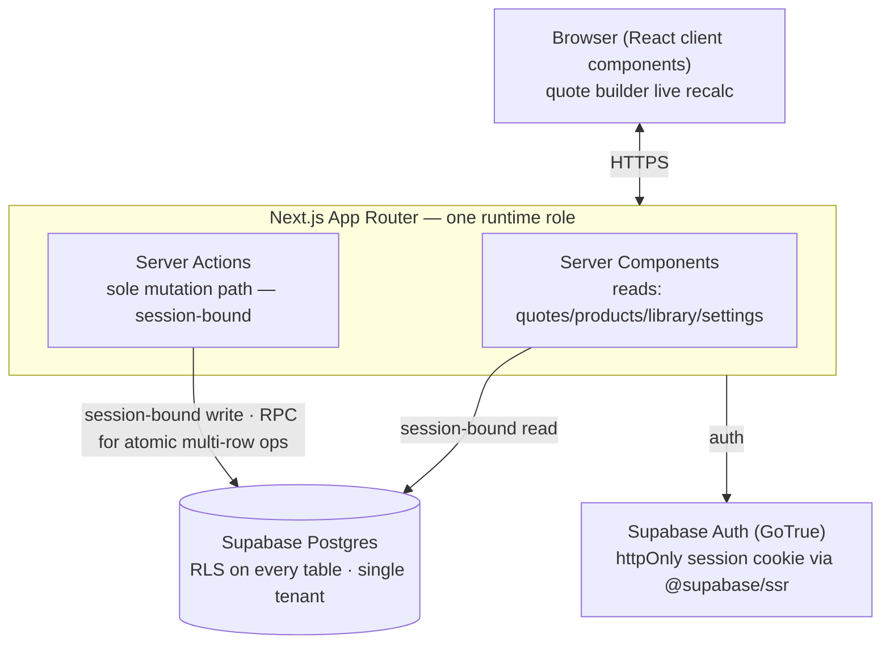
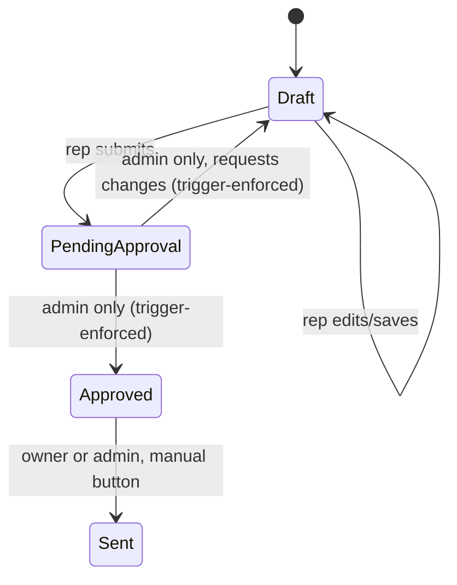

# ARCHITECTURE.md — System Architecture

**Owner:** Viral Parikh
**Last updated:** 2026-08-15
**Source of truth for:** the system structure, component boundaries, and design decisions
that satisfy docs/PRD.md.

> Derived from: docs/PRD.md
> Downstream: docs/TECH-STACK.md, docs/PROJECT-STRUCTURE.md, README.md

---

## Contents

1. [System Architecture](#1-system-architecture)
2. [Data Design](#2-data-design)
3. [Data Flow & Interactions](#3-data-flow--interactions)
4. [Key Design Decisions](#4-key-design-decisions)
5. [Implementation Conventions](#5-implementation-conventions)
6. [Integration Points](#6-integration-points)
7. [Security Posture & Data Classification](#7-security-posture--data-classification)
8. [Non-Functional Approach](#8-non-functional-approach)
9. [Observability & Operations](#9-observability--operations)

---

## 1. System Architecture

RedyQuote is a **single-tenant Next.js modular monolith on Supabase** — one runtime role,
unlike a multi-tenant product that needs to isolate an unauthenticated capture path. Every
request in RedyQuote is an authenticated REDYREF user; there is no public, unauthenticated
surface at all.

Components:

- **Server Components** — the read path. Fetch quotes, products, component library,
  settings, and quote detail using a session-bound Supabase server client
  (`@supabase/ssr`), so RLS applies to every read.
- **Server Actions** — the sole mutation path: save quote, submit/approve/mark-sent, save
  product, save component, save settings, upload favicon. Every action that computes a
  cost breakdown recomputes it server-side from stored line items and settings — the
  client's live-preview numbers are never trusted as the value that gets persisted.
  (PRD-007, NFR-007)
- **Quote builder client component** — the one place needing rich client interactivity
  (live recalculation on every keystroke). Uses the same pricing-calculation function as
  the server (shared TS module) so the live preview and the eventual server-recomputed
  value agree, short of the client being tampered with — in which case the server value
  wins. (PRD-007, NFR-007)
- **Supabase Postgres** — single schema, no `tenant_id` (single-tenant, per PRODUCT.md
  §4). RLS is enabled on every table.
- **Supabase Auth (GoTrue)** — authenticates every request; the session JWT rides in an
  httpOnly cookie and is forwarded to Postgres, where RLS evaluates it. (PRD-001, NFR-002)

No service-role key is used anywhere in the application — every database access happens
under a real authenticated user's session, because RedyQuote has no unauthenticated system
paths to run under an elevated role.

## 2. Data Design

| Table                  | Purpose                                                                                                                                                                       | Key relationships                                     |
| ---------------------- | ----------------------------------------------------------------------------------------------------------------------------------------------------------------------------- | ----------------------------------------------------- |
| `profiles`             | id, full_name, role (`rep` \| `admin`)                                                                                                                                        | 1:1 with a Supabase Auth user                         |
| `settings`             | Singleton row: labor rate, markups, cushion %, commission %, margin floor %, freshness thresholds, favicon                                                                    | Referenced by every quote calculation                 |
| `products`             | Fabricated product catalog: name, SKU, description, vendor, est. labor hours, active                                                                                          | Has many `fab_tiers`, `product_defaults`              |
| `fab_tiers`            | Fab cost per quantity break: product_id, qty_tier, cost, quoted_date, vendor                                                                                                  | Belongs to a Product                                  |
| `product_defaults`     | Default component per category per product                                                                                                                                    | Belongs to a Product; references a Component          |
| `components`           | Component library: category, name, SKU, vendor, environment, cost, default_labor_hours, active                                                                                | Referenced by QuoteLine, ProductDefault               |
| `price_history`        | Append-only: component_id or (product_id, qty_tier), cost, quoted_date, vendor                                                                                                | Written whenever a cost changes                       |
| `quotes`               | Quote header: quote_number, customer_name, product_id, **fab_tier_id**, fab_cost_snapshot, environment, computed cost breakdown, final_price_each, status, owner, approved_by | Has many QuoteLines; has many QuoteStatusHistory rows |
| `quote_lines`          | Line items: quote_id, category, component_id (nullable for misc), description, hard_cost, labor_hours, markup, is_misc, sort_order                                            | Belongs to a Quote                                    |
| `quote_status_history` | **New (PRD-017).** Append-only: quote_id, from_status, to_status, actor, changed_at                                                                                           | Belongs to a Quote                                    |
| `settings_history`     | **New (PRD-018A).** Append-only: changed_field, old_value, new_value, actor, changed_at                                                                                       | Global audit of settings/branding edits               |

## 3. Data Flow & Interactions

**Quote status lifecycle** (PRD-010, PRD-017) — the only state machine in the app:

Every arrow above writes one `quote_status_history` row in the same transaction as the
status change. Any transition not shown (e.g. Draft → Approved, Sent → Draft) is rejected.

**Quote save** (PRD-014): a Server Action receives the quote header fields and the current
line items, recomputes the canonical cost breakdown server-side, then calls a single
Postgres RPC function that upserts the quote header and replaces its line items inside one
transaction. First save also allocates the quote number from a Postgres sequence inside
the same transaction. (PRD-011)

The quote-save path must also enforce the fixed-category invariant from PRD-007A: at most
one non-misc line per fixed category, with misc lines explicitly exempt.

**Product save** (PRD-015): a Server Action calls a single Postgres RPC function that
upserts the product row, replaces its fab tiers and default components, and appends
price-history rows for any tier whose cost changed — all in one transaction.

## 4. Key Design Decisions

| Decision               | Choice                                                                                                                                                                                                                                                                               | Rationale                                                                                                                                                                                                                                                                   |
| ---------------------- | ------------------------------------------------------------------------------------------------------------------------------------------------------------------------------------------------------------------------------------------------------------------------------------ | --------------------------------------------------------------------------------------------------------------------------------------------------------------------------------------------------------------------------------------------------------------------------- |
| Mutation path          | Server Actions only, no separate JSON API layer                                                                                                                                                                                                                                      | Simpler than an SPA+REST split for an app this size; `revalidatePath` after a mutation covers cache invalidation without a client-state library                                                                                                                             |
| Atomicity              | Multi-row writes (quote+lines, product+tiers+defaults+history) go through Postgres RPC functions in one transaction                                                                                                                                                                  | Prevents partial saves from leaving quotes, tiers, defaults, or history in an inconsistent state                                                                                                                                                                            |
| Quote numbering        | Server-generated from a Postgres sequence at first save                                                                                                                                                                                                                              | Removes the client-side counting race that could collide two reps' quote numbers                                                                                                                                                                                            |
| Authorization          | Postgres enforces admin-only review transitions (`Review → Approved`, `Review → Draft`) via a `BEFORE UPDATE` trigger; RLS policies enforce the rest — master-data / settings / branding writes require `role = 'admin'`, quote content edits require owner-or-admin, reads are flat | Admin-owns-master-data model (resolved — PRD §7A / PRD-019); enforced at the database so it is a structural guarantee, not a UI convention. A transition is a trigger, not a policy: `WITH CHECK` cannot see the old row, so RLS cannot express "was Pending, now Approved" |
| Pricing trust boundary | Server recomputes the canonical cost breakdown from line items + settings at save time; client-side recalc is live-preview UX only                                                                                                                                                   | Prevents a tampered client from persisting a fabricated margin and keeps implementation tied to a single canonical formula once defined                                                                                                                                     |
| State machine          | Status transitions validated centrally against the diagram in §3; invalid transitions rejected                                                                                                                                                                                       | Prevents illegal states (e.g. skipping Approved)                                                                                                                                                                                                                            |
| Audit                  | `quote_status_history`, `price_history`, and `settings_history`, written in the same transaction as the change                                                                                                                                                                       | Preserves traceability for quote status, cost, and settings/branding changes                                                                                                                                                                                                |
| Tenancy                | No `tenant_id` anywhere; single schema for REDYREF only                                                                                                                                                                                                                              | Confirmed single-tenant scope (PRODUCT.md §4); avoids speculative multi-tenant complexity for a need that doesn't exist                                                                                                                                                     |
| Service-role key       | Not used anywhere in the app                                                                                                                                                                                                                                                         | No unauthenticated system paths exist, so every DB access is a real session under RLS — nothing needs an elevated role                                                                                                                                                      |
| List view state        | URL query params (`q`, `sort`, `dir`, `page`, `size`); filter → sort → slice in one pure function in `src/lib/list/`; pagination always on, 50 rows per page, uniform across all three lists                                                                                         | The URL survives back and refresh, is pasteable, and is already the shape the eventual Supabase query takes — `?sort=cost&dir=desc&page=2` becomes `.order('cost', {ascending:false}).range(50,99)` with no restructuring. See §4.1                                         |

### 4.1 List view — the alternatives that were rejected

Recorded so they are not reopened from memory. Absorbed 2026-08-15 from the list-sort design
spec, which shipped as PR #38; the scale they were judged against is NFR-001, "a handful of
concurrent users, low hundreds of products/components/quotes."

- **Pagination only above a row threshold.** Controls would appear once a filtered set exceeded
  ~100 rows, leaving today's short lists untouched and preserving Ctrl+F on them. Rejected for
  uniformity: one code path, one design, and no layout change the day the data grows. The
  Ctrl+F objection is answered instead by the page-size selector's `All` option.
- **Pagination on `/quotes` only.** This matches how the data actually grows — quotes accumulate
  without bound while products and components are catalog data, bounded and pruned by
  deactivation — and adds no dead chrome. Rejected because three list screens with two
  behaviours is harder to explain than one uniform rule.
- **A column-def abstraction in `data-table.tsx`.** Rejected: it contradicts that file's
  explicit charter, and the three tables have genuinely divergent cells — badge groups,
  two-line name cells, derived freshness. A column definition rich enough for all three stops
  being simpler than the JSX it replaces.
- **Server Components read `searchParams` and pass one page of rows down.** This one is
  **deferred, not rejected — it is the migration target.** The params object is the seam: when
  Supabase reads land, `page.tsx` reads `searchParams` instead of the client reading
  `useSearchParams()`, and `filter` / `compare` / `page` / `size` become `.eq()` / `.ilike()` /
  `.order()` / `.range()` on the query builder. `applyListView` is then deleted or kept purely
  for its tests. The URL contract does not change, so no bookmark or shared link breaks, and
  nothing in the current design has to be undone to get there. Deferred because it is a real
  refactor of three working screens for a benefit that only lands once Supabase reads exist.
  Trigger recorded in [docs/PROJECT-STRUCTURE.md](PROJECT-STRUCTURE.md) §6.

**Reading the URL client-side bails the whole segment out of prerendering, and that is
accepted.** `useSearchParams()` inside a table component does not make the route dynamic — it
makes Next render the segment on the client. The route still reports `○`, but the only thing
prerendered is `loading.tsx`, so the server response carries no heading, no toolbar, and no
table; only the app shell from `layout.tsx` survives. This was **measured against `next start`,
not inferred**: `/products` returns `BAILOUT_TO_CLIENT_SIDE_RENDERING` and zero `<table>`
elements. Two candidate fixes were tried and **both failed** — `export const dynamic =
"force-dynamic"` (route becomes `ƒ`, content still bails) and deleting `(list)/loading.tsx`
(still bails). Accepted because RedyQuote is an internal tool behind auth, ≥768px only
(NFR-008), a handful of concurrent users (NFR-001), with no SEO surface; the cost is a loading
shell before first paint on three screens, and the fix is the deferred migration above, which
has to happen then anyway. Do not re-measure this from scratch — it costs an afternoon.

## 5. Implementation Conventions

- **Postgres is the enforcement locus for every write, not just the review-stage
  transitions.** Master-data, settings, and branding writes are admin-only; quote content
  edits are owner-or-admin; reads are flat (any authenticated user) — all of these are RLS
  policies. `Review → Approved` and `Review → Draft` are also admin-only,
  but are enforced by the `validate_quote_status_transition` trigger rather than a policy,
  because an RLS `WITH CHECK` clause cannot see the old row and so cannot express a
  transition at all. Trigger or policy, the guarantee is the same and it lives in the
  database: a Server Action must never be the only thing standing between a user and a write
  they aren't allowed. The gate is **two** triggers, not one:
  `validate_quote_status_transition` covers movement, and `enforce_quote_created_in_draft`
  covers creation — without the second, a quote can simply be inserted already approved.
  (PRD-010, PRD-019, NFR-002 — mechanism in `supabase/migrations/0007_quotes.sql`, model in
  [docs/DATABASE.md](DATABASE.md) §5.5)
- **Server Actions are the sole mutation path.** No direct browser-to-Postgres writes.
  (NFR-007)
- **Client-side pricing calculation is preview-only.** The Server Action's recomputed
  value is what gets persisted and what the margin-floor flag is evaluated against.
  (PRD-016, NFR-007)
- **Fixed categories permit one non-misc line each.** This invariant must be enforced in
  validation and in the quote-save transaction boundary; misc lines are exempt.
  (PRD-007A)
- **Multi-row writes that must succeed or fail together go through a Postgres RPC
  function**, not sequential client-driven calls. (PRD-014, PRD-015)
- **Quote numbers are never computed client-side.** (PRD-011)
- **State changes go through the declared transitions in §3 only.** (PRD-010)
- **Audit rows are written in the same transaction as the change they record.**
  (PRD-017, NFR-005)
- **All schema changes are Supabase CLI migrations under `supabase/migrations/`.**
  Hand-editing schema or RLS policies in the Supabase dashboard is prohibited — the
  migration files are the authoritative schema.
- **Zod is the single validation tool** for all Server Action inputs.
- **No `tenant_id`, no per-tenant scaffolding.** (see Key Design Decisions above)

## 6. Integration Points

None in v1 — no external system sends data into or receives data from RedyQuote. "Mark as
Sent" is a manual in-app status change with no email or document delivery (PRODUCT.md §4).
If a future release adds PDF or email quote delivery, it slots in behind the same Server
Action pattern without touching the access/audit model above.

## 7. Security Posture & Data Classification

**Data classification:**

| Data category                    | Classification | Handling                                                                                                    |
| -------------------------------- | -------------- | ----------------------------------------------------------------------------------------------------------- |
| User credentials                 | Restricted     | Managed entirely by Supabase Auth (bcrypt); never logged                                                    |
| Quote/pricing/customer data      | Confidential   | Business-sensitive; visible to any signed-in REDYREF user (flat model), never to an unauthenticated request |
| Settings (markups, margin floor) | Internal       | Admin-only edit, RLS-enforced (PRD-012); readable by any signed-in user                                     |

**Authentication & authorization.** Supabase Auth issues a JWT carried in an httpOnly,
`Secure`, `SameSite` cookie via `@supabase/ssr`. Every Server Component read and Server
Action write happens under that session, and RLS evaluates it at the database — the
non-flat rules (admin-only approval, admin-only master-data / settings / branding writes,
owner-or-admin quote edits) are enforced there, not in application code, so a bypassed or
scripted client is still denied. (PRD-001, PRD-010, PRD-019, NFR-002)

**Encryption.** TLS 1.2+ on all traffic (enforced by Vercel and Supabase); credentials are
bcrypt-hashed, not encrypted. (NFR-004)

**XSS.** React/JSX escapes rendered output by default. Avoid introducing raw HTML rendering
without a reviewed sanitization strategy.

**Threat vectors:**

- Approval bypass via a tampered/scripted client → RLS denies it at the database, not
  just the UI. (NFR-002)
- Fabricated margin via a tampered client → server recomputes the canonical cost breakdown
  server-side before persisting; client-submitted totals are never trusted. (NFR-007)
- Credential theft → Supabase Auth bcrypt + TLS. (NFR-003, NFR-004)
- Data loss on a failed multi-row write → atomic RPC transactions. (PRD-014, PRD-015)

## 8. Non-Functional Approach

| Requirement                    | Structural response                                                                                                                                                           |
| ------------------------------ | ----------------------------------------------------------------------------------------------------------------------------------------------------------------------------- |
| NFR-001 interactive latency    | Server Components render pre-fetched data; the quote builder's live recalc is a pure client-side function with no round trip per keystroke                                    |
| NFR-002 access enforcement     | RLS on every table; the two exits from Review are enforced by the `validate_quote_status_transition` trigger, not a policy — see §5                                           |
| NFR-003 credential security    | Supabase Auth (GoTrue) bcrypt hashing, managed                                                                                                                                |
| NFR-004 transport security     | TLS 1.2+ enforced by Vercel/Supabase                                                                                                                                          |
| NFR-005 auditability           | `price_history` and `quote_status_history`, same-transaction writes                                                                                                           |
| NFR-006 durability             | Phased: Free tier (no backups) pre-production; Supabase Pro daily backups at production cutover. PITR not required for v1 — see PRD NFR-006 and docs/ENVIRONMENTS.md §2       |
| NFR-007 pricing trust boundary | Server-side canonical recompute on every save                                                                                                                                 |
| NFR-008 supported viewports    | Tablet-and-up layouts only; the navigation rail collapses 220px → 64px at `xl` rather than resizing, and a dense table scrolls inside its own container — DESIGN-SYSTEM.md §9 |

## 9. Observability & Operations

No error-tracking or analytics vendor is wired. Sentry and PostHog are deliberately cut for v1
([docs/TECH-STACK.md](TECH-STACK.md) §5) — a single internal tool with a known user set has no
onboarding funnel to measure and no anonymous error volume to triage.

What exists instead:

- **Crash surface** — `src/app/global-error.tsx` renders `error.digest` and nothing else. A raw
  message at the root can carry whatever the app was holding when it died (§7), so the digest is
  the only detail shown; it is also the correlation handle between a user's report and the
  platform log.
- **Route-scoped boundaries** — an `error.tsx` per route group, so a failure in one screen does
  not blank the shell.
- **Platform logs** — Vercel function logs and Supabase logs are the only telemetry. Neither is
  aggregated, searched, nor retained beyond the platform default.

**Gap, stated rather than papered over:** there is no alerting. A failed write, a broken RLS
policy, or a 500 on the approval path surfaces only when a user reports it. The approval gate is
the path where silent failure costs most, and it is exactly the path with no monitor. Revisit at
production cutover, alongside the Supabase Pro move in [docs/TECH-STACK.md](TECH-STACK.md) §7.
