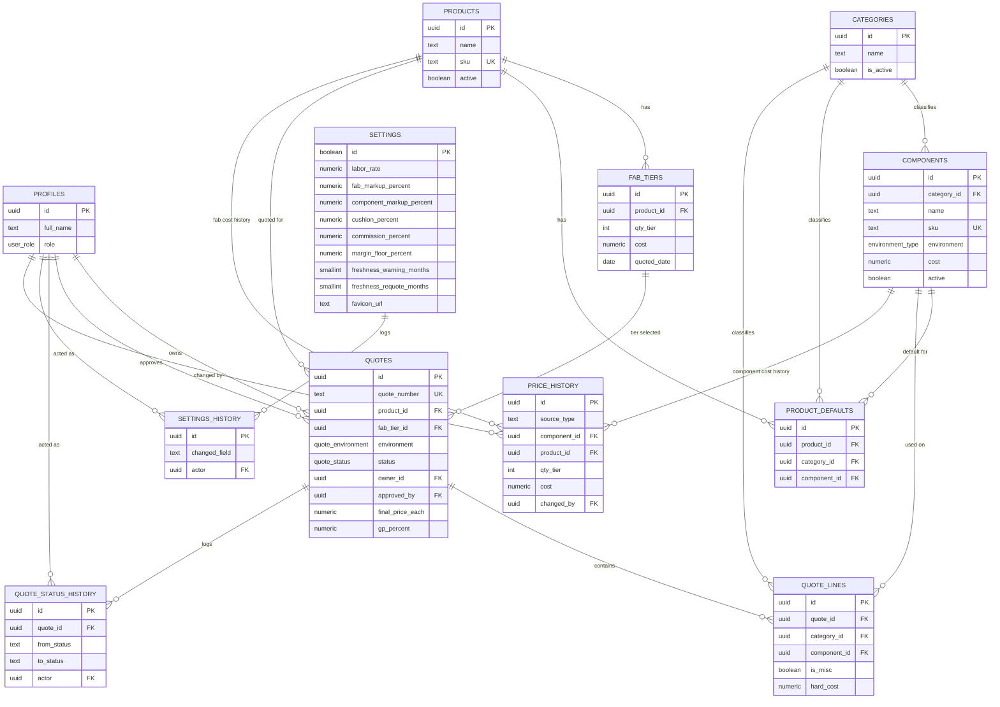

# DATABASE.md — RedyQuote Schema Design

**Author:** Database architecture pass (derived from PRODUCT.md, PRD.md, ARCHITECTURE.md,
TECH-STACK.md, PROJECT-STRUCTURE.md)
**Target:** Supabase Postgres 17, deployed via Supabase CLI migrations
**Status:** Ready to author as `supabase/migrations/*.sql`, with one open dependency flagged
in §8 (pricing formula sign-off, PRD §2A)

> Derived from: docs/PRD.md, docs/ARCHITECTURE.md, docs/PRODUCT.md, docs/TECH-STACK.md
> Downstream: `supabase/migrations/*.sql`, `src/lib/supabase/types.ts`

---

## Contents

1. [System Summary](#1-system-summary)
2. [Entity List](#2-entity-list)
3. [ERD](#3-erd)
4. [Table Definitions](#4-table-definitions)
5. [SQL Schema](#5-sql-schema)
6. [RPC Functions (Atomic Multi-Row Writes)](#6-rpc-functions-atomic-multi-row-writes)
7. [RLS Policies](#7-rls-policies)
8. [Notes & Recommendations](#8-notes--recommendations)

---

## 1. System Summary

RedyQuote is a **single-tenant** quoting system for REDYREF's sales team. Two roles only —
**rep** and **admin** — sit on top of Supabase Auth. Admins own the product catalog,
component library, quantity-tier fab pricing, global estimating settings, and branding.
Reps build quotes against that catalog; every quote moves through a fixed
`Draft → Pending Approval → Approved → Sent` lifecycle, with the
`Pending Approval → Approved` step and all master-data writes **enforced by Postgres RLS**,
not application code (PRD-019, NFR-002).

Three structural guarantees drove this design, matching PRD's stated anti-patterns:

1. **Race-free quote numbering** (PRD-011) — a per-year counter table, incremented with a
   single atomic `INSERT ... ON CONFLICT DO UPDATE`, not client-side counting.
2. **Atomic multi-row writes** (PRD-014, PRD-015) — quote header + lines, and product +
   fab tiers + defaults + price history, are each written inside one `SECURITY INVOKER`
   Postgres function (RPC) so a partial failure can never leave a quote or product
   half-written.
3. **A single canonical cost breakdown** (NFR-007) — the schema stores the
   _server-recomputed_ pricing outputs on `quotes`/`quote_lines`; it does not encode a
   pricing formula. **The formula itself is an open PRD §2A placeholder** — see §8.

Everything else follows standard 3NF normalization, `uuid` primary keys, and audit trails
that are append-only at the database level (not just by application convention).

---

## 2. Entity List

| #   | Table                    | Role                                                                                                   |
| --- | ------------------------ | ------------------------------------------------------------------------------------------------------ |
| 1   | `profiles`               | Extends `auth.users` 1:1 — full name, role (`rep`/`admin`)                                             |
| 2   | `categories`             | Lookup for the fixed quote-line categories (PRD-007A)                                                  |
| 3   | `settings`               | Singleton row — labor rate, markups, cushion/commission %, margin floor, freshness thresholds, favicon |
| 4   | `settings_history`       | Append-only audit of `settings` field changes (PRD-018A)                                               |
| 5   | `products`               | Fabricated product catalog                                                                             |
| 6   | `fab_tiers`              | Quantity-tier fab cost per product                                                                     |
| 7   | `product_defaults`       | Default component per category per product                                                             |
| 8   | `components`             | Component library (category, environment, cost, labor hours)                                           |
| 9   | `price_history`          | Append-only cost history for components and fab tiers                                                  |
| 10  | `quote_number_sequences` | Internal counter backing race-free `Q-YYYY-NNNN` numbering                                             |
| 11  | `quotes`                 | Quote header + server-computed cost breakdown + lifecycle status                                       |
| 12  | `quote_lines`            | Quote line items (one per fixed category + unlimited misc)                                             |
| 13  | `quote_status_history`   | Append-only audit of quote status transitions (PRD-017)                                                |

**Two tables not named in ARCHITECTURE.md's data-design table** were added to close gaps
left open by the source docs — see §8 for the rationale on each (`categories`,
`quote_number_sequences`).

---

## 3. ERD



---

## 4. Table Definitions

Design conventions applied throughout:

- `uuid` primary keys via `gen_random_uuid()` (`pgcrypto`), except `settings` (boolean
  singleton PK) and `quote_number_sequences` (natural `year` PK — an internal counter, not
  a public entity).
- `created_at` / `updated_at` (`timestamptz`) on every mutable table; `updated_at`
  maintained by a shared trigger.
- **No `deleted_at` soft-delete column anywhere.** PRD-018 already defines the product's
  soft-delete equivalent as a domain-specific `active` boolean on `products`/`components`
  — an item stays fully visible and joinable (unlike a conventional hidden soft-delete
  row), just not selectable for _new_ quote lines. Every other table either forbids delete
  outright (append-only audit tables, `quotes`) or has no deletion requirement at all. See
  §8 for the full rationale.
- Every FK column is explicitly indexed (Postgres does not do this automatically).
- RLS is enabled on **every** table (`ALTER TABLE ... ENABLE ROW LEVEL SECURITY`), per
  ARCHITECTURE §1/§7.

### 4.1 `profiles`

1:1 extension of `auth.users` (PRD-001, PRD-002). Populated automatically by a trigger on
`auth.users` insert.

| Column       | Type          | Constraints                                 |
| ------------ | ------------- | ------------------------------------------- |
| `id`         | `uuid`        | PK, FK → `auth.users(id)` ON DELETE CASCADE |
| `full_name`  | `text`        | NOT NULL                                    |
| `role`       | `user_role`   | NOT NULL, DEFAULT `'rep'`                   |
| `created_at` | `timestamptz` | NOT NULL, DEFAULT `now()`                   |
| `updated_at` | `timestamptz` | NOT NULL, DEFAULT `now()`                   |

### 4.2 `categories`

Backs the **fixed quote-line categories** from PRD-007A. The actual list of names is a
product decision still pending in the source docs ("MUST be defined before implementation
begins") — modeling it as a table rather than a hardcoded enum lets that list be populated
and edited by migration/admin UI without a schema change once it's finalized.

| Column                      | Type          | Constraints                     |
| --------------------------- | ------------- | ------------------------------- |
| `id`                        | `uuid`        | PK, DEFAULT `gen_random_uuid()` |
| `name`                      | `text`        | NOT NULL, UNIQUE                |
| `is_active`                 | `boolean`     | NOT NULL, DEFAULT `true`        |
| `sort_order`                | `integer`     | NOT NULL, DEFAULT `0`           |
| `created_at` / `updated_at` | `timestamptz` | NOT NULL                        |

### 4.3 `settings`

Singleton row (PRD-012). Enforced as exactly one row via a `boolean` primary key with a
`CHECK (id)` constraint — a well-known Postgres singleton pattern (the PK's uniqueness
does the enforcement; the `CHECK` forbids the row ever being `false`).

| Column                      | Type            | Constraints                                  |
| --------------------------- | --------------- | -------------------------------------------- |
| `id`                        | `boolean`       | PK, DEFAULT `true`, CHECK (`id`)             |
| `labor_rate`                | `numeric(10,2)` | NOT NULL                                     |
| `fab_markup_percent`        | `numeric(5,2)`  | NOT NULL                                     |
| `component_markup_percent`  | `numeric(5,2)`  | NOT NULL                                     |
| `cushion_percent`           | `numeric(5,2)`  | NOT NULL                                     |
| `commission_percent`        | `numeric(5,2)`  | NOT NULL                                     |
| `margin_floor_percent`      | `numeric(5,2)`  | NOT NULL                                     |
| `freshness_warning_months`  | `smallint`      | NOT NULL                                     |
| `freshness_requote_months`  | `smallint`      | NOT NULL, CHECK `> freshness_warning_months` |
| `favicon_url`               | `text`          | NULL                                         |
| `updated_by`                | `uuid`          | FK → `profiles(id)`                          |
| `created_at` / `updated_at` | `timestamptz`   | NOT NULL                                     |

### 4.4 `settings_history`

Append-only (PRD-018A, NFR-005). One row per changed field, written by a trigger in the
same transaction as the `settings` update — never insertable directly by a client (see §7).

| Column          | Type          | Constraints                   |
| --------------- | ------------- | ----------------------------- |
| `id`            | `uuid`        | PK                            |
| `changed_field` | `text`        | NOT NULL                      |
| `old_value`     | `text`        | NULL                          |
| `new_value`     | `text`        | NULL                          |
| `actor`         | `uuid`        | NOT NULL, FK → `profiles(id)` |
| `changed_at`    | `timestamptz` | NOT NULL, DEFAULT `now()`     |

### 4.5 `products`

| Column                      | Type           | Constraints                         |
| --------------------------- | -------------- | ----------------------------------- |
| `id`                        | `uuid`         | PK                                  |
| `name`                      | `text`         | NOT NULL                            |
| `sku`                       | `text`         | NOT NULL, UNIQUE                    |
| `description`               | `text`         | NULL                                |
| `vendor`                    | `text`         | NULL                                |
| `est_labor_hours`           | `numeric(6,2)` | NOT NULL, DEFAULT `0`, CHECK `>= 0` |
| `active`                    | `boolean`      | NOT NULL, DEFAULT `true`            |
| `created_at` / `updated_at` | `timestamptz`  | NOT NULL                            |

### 4.6 `fab_tiers`

Quantity-tier fab pricing (PRD-004). One live row per `(product_id, qty_tier)`; changes to
`cost` append a `price_history` row via trigger.

| Column                      | Type            | Constraints                                     |
| --------------------------- | --------------- | ----------------------------------------------- |
| `id`                        | `uuid`          | PK                                              |
| `product_id`                | `uuid`          | NOT NULL, FK → `products(id)` ON DELETE CASCADE |
| `qty_tier`                  | `integer`       | NOT NULL, CHECK `> 0`                           |
| `cost`                      | `numeric(12,2)` | NOT NULL, CHECK `>= 0`                          |
| `quoted_date`               | `date`          | NOT NULL                                        |
| `vendor`                    | `text`          | NULL                                            |
| `created_at` / `updated_at` | `timestamptz`   | NOT NULL                                        |
| —                           | —               | UNIQUE `(product_id, qty_tier)`                 |

### 4.7 `product_defaults`

Default component per category per product (PRD-005).

| Column                      | Type          | Constraints                                     |
| --------------------------- | ------------- | ----------------------------------------------- |
| `id`                        | `uuid`        | PK                                              |
| `product_id`                | `uuid`        | NOT NULL, FK → `products(id)` ON DELETE CASCADE |
| `category_id`               | `uuid`        | NOT NULL, FK → `categories(id)`                 |
| `component_id`              | `uuid`        | NOT NULL, FK → `components(id)`                 |
| `created_at` / `updated_at` | `timestamptz` | NOT NULL                                        |
| —                           | —             | UNIQUE `(product_id, category_id)`              |

### 4.8 `components`

Component library (PRD-006).

| Column                      | Type               | Constraints                         |
| --------------------------- | ------------------ | ----------------------------------- |
| `id`                        | `uuid`             | PK                                  |
| `category_id`               | `uuid`             | NOT NULL, FK → `categories(id)`     |
| `name`                      | `text`             | NOT NULL                            |
| `sku`                       | `text`             | NOT NULL, UNIQUE                    |
| `vendor`                    | `text`             | NULL                                |
| `environment`               | `environment_type` | NOT NULL, DEFAULT `'any'`           |
| `cost`                      | `numeric(12,2)`    | NOT NULL, CHECK `>= 0`              |
| `default_labor_hours`       | `numeric(6,2)`     | NOT NULL, DEFAULT `0`, CHECK `>= 0` |
| `active`                    | `boolean`          | NOT NULL, DEFAULT `true`            |
| `created_at` / `updated_at` | `timestamptz`      | NOT NULL                            |

### 4.9 `price_history`

Append-only cost history for **either** a component **or** a fab tier (discriminated by
`source_type`), written automatically by triggers whenever `components.cost` or
`fab_tiers.cost` changes (NFR-005). Modeled as one table (matching ARCHITECTURE.md's data
design table) with a `CHECK` constraint enforcing exactly one relation is populated,
rather than two separate tables — see §8 for the trade-off.

| Column         | Type            | Constraints                                                  |
| -------------- | --------------- | ------------------------------------------------------------ |
| `id`           | `uuid`          | PK                                                           |
| `source_type`  | `text`          | NOT NULL, CHECK IN (`'component'`,`'fab_tier'`)              |
| `component_id` | `uuid`          | FK → `components(id)`, NULL unless `source_type='component'` |
| `product_id`   | `uuid`          | FK → `products(id)`, NULL unless `source_type='fab_tier'`    |
| `qty_tier`     | `integer`       | NULL unless `source_type='fab_tier'`                         |
| `cost`         | `numeric(12,2)` | NOT NULL                                                     |
| `quoted_date`  | `date`          | NOT NULL                                                     |
| `vendor`       | `text`          | NULL                                                         |
| `changed_by`   | `uuid`          | NOT NULL, FK → `profiles(id)`                                |
| `created_at`   | `timestamptz`   | NOT NULL, DEFAULT `now()`                                    |

### 4.10 `quote_number_sequences`

Internal bookkeeping only — never read or written directly by application code, only by
`fn_save_quote` (§6). Backs PRD-011's race-free `Q-YYYY-NNNN` numbering.

| Column        | Type       | Constraints           |
| ------------- | ---------- | --------------------- |
| `year`        | `smallint` | PK                    |
| `last_number` | `integer`  | NOT NULL, DEFAULT `0` |

### 4.11 `quotes`

Quote header, server-computed cost breakdown, and lifecycle status (PRD-007, PRD-010,
PRD-011). `fab_cost_snapshot` and every `quote_lines.hard_cost` capture the cost **as of
the save**, so a later fab-tier or component price change never silently drifts a
previously saved quote — the historical basis is preserved, matching the "one consistent
formula, agreeing every time" requirement.

| Column                      | Type                | Constraints                                              |
| --------------------------- | ------------------- | -------------------------------------------------------- |
| `id`                        | `uuid`              | PK                                                       |
| `quote_number`              | `text`              | NOT NULL, UNIQUE — format `Q-YYYY-NNNN`                  |
| `customer_name`             | `text`              | NOT NULL                                                 |
| `product_id`                | `uuid`              | NOT NULL, FK → `products(id)`                            |
| `fab_tier_id`               | `uuid`              | NOT NULL, FK → `fab_tiers(id)`                           |
| `fab_cost_snapshot`         | `numeric(12,2)`     | NOT NULL — fab cost captured at save time                |
| `environment`               | `quote_environment` | NOT NULL                                                 |
| `status`                    | `quote_status`      | NOT NULL, DEFAULT `'draft'`                              |
| `owner_id`                  | `uuid`              | NOT NULL, FK → `profiles(id)`                            |
| `approved_by`               | `uuid`              | FK → `profiles(id)`, NULL until approved                 |
| `submitted_at`              | `timestamptz`       | NULL                                                     |
| `approved_at`               | `timestamptz`       | NULL                                                     |
| `sent_at`                   | `timestamptz`       | NULL                                                     |
| `total_hard_cost`           | `numeric(12,2)`     | NOT NULL, DEFAULT `0`                                    |
| `total_labor_cost`          | `numeric(12,2)`     | NOT NULL, DEFAULT `0`                                    |
| `cushion_amount`            | `numeric(12,2)`     | NOT NULL, DEFAULT `0`                                    |
| `commission_amount`         | `numeric(12,2)`     | NOT NULL, DEFAULT `0`                                    |
| `total_cost`                | `numeric(12,2)`     | NOT NULL, DEFAULT `0`                                    |
| `final_price_each`          | `numeric(12,2)`     | NOT NULL, DEFAULT `0`                                    |
| `gp_dollars`                | `numeric(12,2)`     | NOT NULL, DEFAULT `0`                                    |
| `gp_percent`                | `numeric(6,3)`      | NOT NULL, DEFAULT `0`                                    |
| `below_margin_floor`        | `boolean`           | NOT NULL, DEFAULT `false` — advisory flag only (PRD-016) |
| `created_at` / `updated_at` | `timestamptz`       | NOT NULL                                                 |

> **The nine pricing columns above are storage for server-recomputed _outputs_, not an
> implementation of the formula.** The formula that produces them is PRD §2A's open
> placeholder — see §8.

### 4.12 `quote_lines`

One line per fixed category, plus unlimited ad-hoc misc lines (PRD-007, PRD-007A).

| Column                      | Type            | Constraints                                                                          |
| --------------------------- | --------------- | ------------------------------------------------------------------------------------ |
| `id`                        | `uuid`          | PK                                                                                   |
| `quote_id`                  | `uuid`          | NOT NULL, FK → `quotes(id)` ON DELETE CASCADE                                        |
| `category_id`               | `uuid`          | FK → `categories(id)`, required unless `is_misc`                                     |
| `component_id`              | `uuid`          | FK → `components(id)`, NULL for misc / custom lines                                  |
| `description`               | `text`          | NOT NULL                                                                             |
| `is_misc`                   | `boolean`       | NOT NULL, DEFAULT `false`                                                            |
| `hard_cost`                 | `numeric(12,2)` | NOT NULL, DEFAULT `0` — snapshotted at save                                          |
| `labor_hours`               | `numeric(6,2)`  | NOT NULL, DEFAULT `0`                                                                |
| `labor_cost`                | `numeric(12,2)` | NOT NULL, DEFAULT `0` — snapshotted at save                                          |
| `markup_percent`            | `numeric(5,2)`  | NOT NULL, DEFAULT `0`                                                                |
| `environment_mismatch`      | `boolean`       | NOT NULL, DEFAULT `false` (PRD-008)                                                  |
| `sort_order`                | `integer`       | NOT NULL, DEFAULT `0`                                                                |
| `created_at` / `updated_at` | `timestamptz`   | NOT NULL                                                                             |
| —                           | —               | CHECK (`is_misc` OR `category_id IS NOT NULL`)                                       |
| —                           | —               | UNIQUE partial index `(quote_id, category_id) WHERE NOT is_misc` — enforces PRD-007A |

### 4.13 `quote_status_history`

Append-only (PRD-017, NFR-005). Written by an `AFTER UPDATE` trigger on `quotes`, in the
same transaction as the status change — never insertable directly by a client (see §7).

| Column        | Type          | Constraints                                   |
| ------------- | ------------- | --------------------------------------------- |
| `id`          | `uuid`        | PK                                            |
| `quote_id`    | `uuid`        | NOT NULL, FK → `quotes(id)` ON DELETE CASCADE |
| `from_status` | `text`        | NULL (NULL on the initial Draft insert)       |
| `to_status`   | `text`        | NOT NULL                                      |
| `actor`       | `uuid`        | NOT NULL, FK → `profiles(id)`                 |
| `changed_at`  | `timestamptz` | NOT NULL, DEFAULT `now()`                     |

---

## 5. SQL Schema

> Suggested migration split, per `PROJECT-STRUCTURE.md` §5 naming
> (`NNNN_snake_case_description.sql`): `0001_extensions_and_types`,
> `0002_profiles_and_auth_trigger`, `0003_master_data`, `0004_quotes`, `0005_rpc_functions`,
> `0006_rls_policies`, `0007_seed_settings`. Presented here as one consolidated script.

```sql
-- ============================================================================
-- 0001: Extensions & Enums
-- ============================================================================
create extension if not exists pgcrypto;

create type user_role as enum ('rep', 'admin');
create type quote_status as enum ('draft', 'pending_approval', 'approved', 'sent');
create type environment_type as enum ('any', 'indoor', 'outdoor');
create type quote_environment as enum ('indoor', 'outdoor');

-- Shared updated_at trigger
create or replace function set_updated_at()
returns trigger
language plpgsql
as $$
begin
  new.updated_at := now();
  return new;
end;
$$;

-- ============================================================================
-- 0002: profiles + auth integration (PRD-001, PRD-002)
-- ============================================================================
create table profiles (
  id          uuid primary key references auth.users(id) on delete cascade,
  full_name   text not null,
  role        user_role not null default 'rep',
  created_at  timestamptz not null default now(),
  updated_at  timestamptz not null default now()
);

create trigger profiles_set_updated_at
  before update on profiles
  for each row execute function set_updated_at();

-- Auto-provision a profile on first sign-in (PRD-002)
create or replace function handle_new_user()
returns trigger
language plpgsql
security definer
set search_path = public
as $$
begin
  insert into public.profiles (id, full_name, role)
  values (new.id, coalesce(new.raw_user_meta_data->>'full_name', new.email), 'rep');
  return new;
end;
$$;

create trigger on_auth_user_created
  after insert on auth.users
  for each row execute function handle_new_user();

-- is_admin() helper — SECURITY DEFINER so RLS policies on `profiles` itself
-- don't recurse when they call it.
create or replace function is_admin()
returns boolean
language sql
stable
security definer
set search_path = public
as $$
  select exists (
    select 1 from public.profiles where id = auth.uid() and role = 'admin'
  );
$$;

-- ============================================================================
-- 0003: Master data — categories, settings, products, fab_tiers,
--       product_defaults, components, price_history
-- ============================================================================
create table categories (
  id          uuid primary key default gen_random_uuid(),
  name        text not null unique,
  is_active   boolean not null default true,
  sort_order  integer not null default 0,
  created_at  timestamptz not null default now(),
  updated_at  timestamptz not null default now()
);
create trigger categories_set_updated_at
  before update on categories for each row execute function set_updated_at();

create table settings (
  id                          boolean primary key default true,
  labor_rate                  numeric(10,2) not null,
  fab_markup_percent          numeric(5,2) not null,
  component_markup_percent    numeric(5,2) not null,
  cushion_percent             numeric(5,2) not null,
  commission_percent          numeric(5,2) not null,
  margin_floor_percent        numeric(5,2) not null,
  freshness_warning_months    smallint not null,
  freshness_requote_months    smallint not null,
  favicon_url                 text,
  updated_by                  uuid references profiles(id),
  created_at                  timestamptz not null default now(),
  updated_at                  timestamptz not null default now(),
  constraint settings_singleton check (id),
  constraint settings_freshness_order check (freshness_requote_months > freshness_warning_months)
);
create trigger settings_set_updated_at
  before update on settings for each row execute function set_updated_at();

create table settings_history (
  id             uuid primary key default gen_random_uuid(),
  changed_field  text not null,
  old_value      text,
  new_value      text,
  actor          uuid not null references profiles(id),
  changed_at     timestamptz not null default now()
);
create index idx_settings_history_actor on settings_history(actor);
create index idx_settings_history_changed_at on settings_history(changed_at desc);

-- Audit trigger: log every changed settings field in the same transaction
create or replace function log_settings_change()
returns trigger
language plpgsql
security definer
set search_path = public
as $$
declare
  v_actor uuid := auth.uid();
  v_col   text;
  v_old   text;
  v_new   text;
begin
  for v_col in
    select unnest(array[
      'labor_rate','fab_markup_percent','component_markup_percent','cushion_percent',
      'commission_percent','margin_floor_percent','freshness_warning_months',
      'freshness_requote_months','favicon_url'
    ])
  loop
    execute format('select ($1).%I::text, ($2).%I::text', v_col, v_col)
      into v_old, v_new using old, new;
    if v_old is distinct from v_new then
      insert into settings_history(changed_field, old_value, new_value, actor)
      values (v_col, v_old, v_new, v_actor);
    end if;
  end loop;
  return new;
end;
$$;

create trigger settings_audit
  after update on settings
  for each row execute function log_settings_change();

create table products (
  id                uuid primary key default gen_random_uuid(),
  name              text not null,
  sku               text not null unique,
  description       text,
  vendor            text,
  est_labor_hours   numeric(6,2) not null default 0 check (est_labor_hours >= 0),
  active            boolean not null default true,
  created_at        timestamptz not null default now(),
  updated_at        timestamptz not null default now()
);
create index idx_products_active on products(active);
create trigger products_set_updated_at
  before update on products for each row execute function set_updated_at();

create table fab_tiers (
  id            uuid primary key default gen_random_uuid(),
  product_id    uuid not null references products(id) on delete cascade,
  qty_tier      integer not null check (qty_tier > 0),
  cost          numeric(12,2) not null check (cost >= 0),
  quoted_date   date not null,
  vendor        text,
  created_at    timestamptz not null default now(),
  updated_at    timestamptz not null default now(),
  unique (product_id, qty_tier)
);
create index idx_fab_tiers_product_id on fab_tiers(product_id);
create trigger fab_tiers_set_updated_at
  before update on fab_tiers for each row execute function set_updated_at();

create table components (
  id                    uuid primary key default gen_random_uuid(),
  category_id           uuid not null references categories(id),
  name                  text not null,
  sku                   text not null unique,
  vendor                text,
  environment           environment_type not null default 'any',
  cost                  numeric(12,2) not null check (cost >= 0),
  default_labor_hours   numeric(6,2) not null default 0 check (default_labor_hours >= 0),
  active                boolean not null default true,
  created_at            timestamptz not null default now(),
  updated_at            timestamptz not null default now()
);
create index idx_components_category_id on components(category_id);
create index idx_components_active on components(active);
create trigger components_set_updated_at
  before update on components for each row execute function set_updated_at();

create table product_defaults (
  id            uuid primary key default gen_random_uuid(),
  product_id    uuid not null references products(id) on delete cascade,
  category_id   uuid not null references categories(id),
  component_id  uuid not null references components(id),
  created_at    timestamptz not null default now(),
  updated_at    timestamptz not null default now(),
  unique (product_id, category_id)
);
create index idx_product_defaults_product_id on product_defaults(product_id);
create index idx_product_defaults_category_id on product_defaults(category_id);
create index idx_product_defaults_component_id on product_defaults(component_id);
create trigger product_defaults_set_updated_at
  before update on product_defaults for each row execute function set_updated_at();

create table price_history (
  id            uuid primary key default gen_random_uuid(),
  source_type   text not null check (source_type in ('component', 'fab_tier')),
  component_id  uuid references components(id),
  product_id    uuid references products(id),
  qty_tier      integer,
  cost          numeric(12,2) not null,
  quoted_date   date not null,
  vendor        text,
  changed_by    uuid not null references profiles(id),
  created_at    timestamptz not null default now(),
  constraint price_history_source_shape check (
    (source_type = 'component' and component_id is not null and product_id is null and qty_tier is null)
    or
    (source_type = 'fab_tier' and product_id is not null and qty_tier is not null and component_id is null)
  )
);
create index idx_price_history_component_id on price_history(component_id);
create index idx_price_history_product_tier on price_history(product_id, qty_tier);
create index idx_price_history_changed_by on price_history(changed_by);

-- Auto-append price history when a live cost changes (NFR-005)
create or replace function log_component_price_change()
returns trigger
language plpgsql
security definer
set search_path = public
as $$
begin
  if new.cost is distinct from old.cost then
    insert into price_history(source_type, component_id, cost, quoted_date, vendor, changed_by)
    values ('component', new.id, new.cost, current_date, new.vendor, auth.uid());
  end if;
  return new;
end;
$$;
create trigger components_price_history
  after update on components
  for each row execute function log_component_price_change();

create or replace function log_fab_tier_price_change()
returns trigger
language plpgsql
security definer
set search_path = public
as $$
begin
  if new.cost is distinct from old.cost then
    insert into price_history(source_type, product_id, qty_tier, cost, quoted_date, vendor, changed_by)
    values ('fab_tier', new.product_id, new.qty_tier, new.cost, new.quoted_date, new.vendor, auth.uid());
  end if;
  return new;
end;
$$;
create trigger fab_tiers_price_history
  after update on fab_tiers
  for each row execute function log_fab_tier_price_change();

-- ============================================================================
-- 0004: Quotes
-- ============================================================================
create table quote_number_sequences (
  year         smallint primary key,
  last_number  integer not null default 0
);

create table quotes (
  id                    uuid primary key default gen_random_uuid(),
  quote_number          text not null unique,
  customer_name         text not null,
  product_id            uuid not null references products(id),
  fab_tier_id           uuid not null references fab_tiers(id),
  fab_cost_snapshot     numeric(12,2) not null,
  environment           quote_environment not null,
  status                quote_status not null default 'draft',
  owner_id              uuid not null references profiles(id),
  approved_by           uuid references profiles(id),
  submitted_at          timestamptz,
  approved_at           timestamptz,
  sent_at               timestamptz,
  total_hard_cost       numeric(12,2) not null default 0,
  total_labor_cost      numeric(12,2) not null default 0,
  cushion_amount        numeric(12,2) not null default 0,
  commission_amount     numeric(12,2) not null default 0,
  total_cost            numeric(12,2) not null default 0,
  final_price_each      numeric(12,2) not null default 0,
  gp_dollars            numeric(12,2) not null default 0,
  gp_percent            numeric(6,3) not null default 0,
  below_margin_floor    boolean not null default false,
  created_at            timestamptz not null default now(),
  updated_at            timestamptz not null default now()
);
create index idx_quotes_owner_id on quotes(owner_id);
create index idx_quotes_approved_by on quotes(approved_by);
create index idx_quotes_product_id on quotes(product_id);
create index idx_quotes_fab_tier_id on quotes(fab_tier_id);
create index idx_quotes_status on quotes(status);
create trigger quotes_set_updated_at
  before update on quotes for each row execute function set_updated_at();

create table quote_lines (
  id                    uuid primary key default gen_random_uuid(),
  quote_id              uuid not null references quotes(id) on delete cascade,
  category_id           uuid references categories(id),
  component_id          uuid references components(id),
  description           text not null,
  is_misc               boolean not null default false,
  hard_cost             numeric(12,2) not null default 0,
  labor_hours           numeric(6,2) not null default 0,
  labor_cost            numeric(12,2) not null default 0,
  markup_percent        numeric(5,2) not null default 0,
  environment_mismatch  boolean not null default false,
  sort_order            integer not null default 0,
  created_at            timestamptz not null default now(),
  updated_at            timestamptz not null default now(),
  constraint quote_lines_category_required_unless_misc check (is_misc or category_id is not null)
);
create index idx_quote_lines_quote_id on quote_lines(quote_id);
create index idx_quote_lines_category_id on quote_lines(category_id);
create index idx_quote_lines_component_id on quote_lines(component_id);
-- PRD-007A: at most one non-misc line per fixed category per quote
create unique index uq_quote_lines_one_per_fixed_category
  on quote_lines(quote_id, category_id) where not is_misc;
create trigger quote_lines_set_updated_at
  before update on quote_lines for each row execute function set_updated_at();

create table quote_status_history (
  id           uuid primary key default gen_random_uuid(),
  quote_id     uuid not null references quotes(id) on delete cascade,
  from_status  text,
  to_status    text not null,
  actor        uuid not null references profiles(id),
  changed_at   timestamptz not null default now()
);
create index idx_quote_status_history_quote_id on quote_status_history(quote_id);
create index idx_quote_status_history_actor on quote_status_history(actor);

-- Validate the state machine BEFORE the row is written (PRD-010, NFR-002)
create or replace function validate_quote_status_transition()
returns trigger
language plpgsql
as $$
begin
  if new.status = old.status then
    return new; -- ordinary content edit, no transition
  end if;

  if old.status = 'draft' and new.status = 'pending_approval' then
    new.submitted_at := now();
  elsif old.status = 'pending_approval' and new.status = 'approved' then
    if not is_admin() then
      raise exception 'Only an admin may approve a quote (PRD-010)';
    end if;
    new.approved_by := auth.uid();
    new.approved_at := now();
  elsif old.status = 'approved' and new.status = 'sent' then
    new.sent_at := now();
  else
    raise exception 'Invalid quote status transition: % -> %', old.status, new.status;
  end if;

  return new;
end;
$$;
create trigger quotes_validate_status_transition
  before update on quotes
  for each row execute function validate_quote_status_transition();

-- Log every status change AFTER it's validated and applied (PRD-017, NFR-005)
create or replace function log_quote_status_change()
returns trigger
language plpgsql
security definer
set search_path = public
as $$
begin
  if new.status is distinct from old.status then
    insert into quote_status_history(quote_id, from_status, to_status, actor)
    values (new.id, old.status::text, new.status::text, auth.uid());
  end if;
  return new;
end;
$$;
create trigger quotes_log_status_change
  after update on quotes
  for each row execute function log_quote_status_change();

-- Log the initial Draft creation too
create or replace function log_quote_status_insert()
returns trigger
language plpgsql
security definer
set search_path = public
as $$
begin
  insert into quote_status_history(quote_id, from_status, to_status, actor)
  values (new.id, null, new.status::text, auth.uid());
  return new;
end;
$$;
create trigger quotes_log_status_insert
  after insert on quotes
  for each row execute function log_quote_status_insert();
```

---

## 6. RPC Functions (Atomic Multi-Row Writes)

Per ARCHITECTURE §1/§3/§5: Server Actions compute the canonical cost breakdown in
TypeScript (`src/lib/pricing/`), then call **one** of these functions to persist
everything atomically. These functions are `SECURITY INVOKER` (the default) — they run
under the calling user's own session, so the RLS policies in §7 still apply row-by-row
inside them. That's intentional: it's how the app satisfies "no service-role key anywhere"
(TECH-STACK §6) while still getting transactional atomicity — the function body itself is
one transaction, and every row it touches is still subject to RLS as that user.

```sql
-- ----------------------------------------------------------------------------
-- fn_save_quote: atomic upsert of a quote header + full replacement of its
-- lines (PRD-014). Allocates the quote number race-free on first save
-- (PRD-011). Receives already-computed pricing values — it does not compute
-- them (NFR-007: computation lives in the shared TS pricing module).
-- ----------------------------------------------------------------------------
create or replace function fn_save_quote(
  p_quote_id       uuid,           -- null => new quote
  p_customer_name  text,
  p_product_id     uuid,
  p_fab_tier_id    uuid,
  p_environment    quote_environment,
  p_owner_id       uuid,
  p_pricing        jsonb,          -- server-recomputed totals, see shape below
  p_lines          jsonb           -- array of line objects, see shape below
)
returns quotes
language plpgsql
security invoker
as $$
declare
  v_quote   quotes;
  v_year    smallint := extract(year from now())::smallint;
  v_seq     integer;
  v_number  text;
begin
  if p_quote_id is null then
    insert into quote_number_sequences(year, last_number)
    values (v_year, 1)
    on conflict (year)
      do update set last_number = quote_number_sequences.last_number + 1
    returning last_number into v_seq;

    v_number := 'Q-' || v_year || '-' || lpad(v_seq::text, 4, '0');

    insert into quotes (
      quote_number, customer_name, product_id, fab_tier_id, fab_cost_snapshot,
      environment, owner_id,
      total_hard_cost, total_labor_cost, cushion_amount, commission_amount,
      total_cost, final_price_each, gp_dollars, gp_percent, below_margin_floor
    ) values (
      v_number, p_customer_name, p_product_id, p_fab_tier_id,
      (p_pricing->>'fab_cost_snapshot')::numeric,
      p_environment, p_owner_id,
      (p_pricing->>'total_hard_cost')::numeric,
      (p_pricing->>'total_labor_cost')::numeric,
      (p_pricing->>'cushion_amount')::numeric,
      (p_pricing->>'commission_amount')::numeric,
      (p_pricing->>'total_cost')::numeric,
      (p_pricing->>'final_price_each')::numeric,
      (p_pricing->>'gp_dollars')::numeric,
      (p_pricing->>'gp_percent')::numeric,
      (p_pricing->>'below_margin_floor')::boolean
    )
    returning * into v_quote;
  else
    update quotes set
      customer_name       = p_customer_name,
      product_id           = p_product_id,
      fab_tier_id          = p_fab_tier_id,
      fab_cost_snapshot    = (p_pricing->>'fab_cost_snapshot')::numeric,
      environment          = p_environment,
      total_hard_cost      = (p_pricing->>'total_hard_cost')::numeric,
      total_labor_cost     = (p_pricing->>'total_labor_cost')::numeric,
      cushion_amount       = (p_pricing->>'cushion_amount')::numeric,
      commission_amount    = (p_pricing->>'commission_amount')::numeric,
      total_cost           = (p_pricing->>'total_cost')::numeric,
      final_price_each     = (p_pricing->>'final_price_each')::numeric,
      gp_dollars           = (p_pricing->>'gp_dollars')::numeric,
      gp_percent           = (p_pricing->>'gp_percent')::numeric,
      below_margin_floor   = (p_pricing->>'below_margin_floor')::boolean
    where id = p_quote_id
    returning * into v_quote;

    if not found then
      raise exception 'Quote % not found or not permitted', p_quote_id;
    end if;
  end if;

  -- Replace all line items inside the same transaction (PRD-014).
  -- This is the RPC-internal delete+insert the anti-pattern in
  -- PRODUCT.md §6 warns against doing client-side/sequentially — here it's
  -- one function call, one transaction, so a failed insert rolls back the
  -- delete too.
  delete from quote_lines where quote_id = v_quote.id;

  insert into quote_lines (
    quote_id, category_id, component_id, description, is_misc,
    hard_cost, labor_hours, labor_cost, markup_percent,
    environment_mismatch, sort_order
  )
  select
    v_quote.id,
    nullif(l->>'category_id', '')::uuid,
    nullif(l->>'component_id', '')::uuid,
    l->>'description',
    coalesce((l->>'is_misc')::boolean, false),
    coalesce((l->>'hard_cost')::numeric, 0),
    coalesce((l->>'labor_hours')::numeric, 0),
    coalesce((l->>'labor_cost')::numeric, 0),
    coalesce((l->>'markup_percent')::numeric, 0),
    coalesce((l->>'environment_mismatch')::boolean, false),
    coalesce((l->>'sort_order')::integer, 0)
  from jsonb_array_elements(p_lines) as l;
  -- PRD-007A's one-per-fixed-category invariant is additionally enforced by
  -- uq_quote_lines_one_per_fixed_category — a violation here raises and
  -- rolls back the whole function call, header included.

  return v_quote;
end;
$$;

-- ----------------------------------------------------------------------------
-- fn_submit_quote_status: thin wrapper for status transitions. The real
-- enforcement is the BEFORE UPDATE trigger (validate_quote_status_transition)
-- and the RLS UPDATE policy on quotes — this function exists only so a
-- Server Action has a single, explicit entry point (PRD-010).
-- ----------------------------------------------------------------------------
create or replace function fn_transition_quote_status(
  p_quote_id  uuid,
  p_to_status quote_status
)
returns quotes
language plpgsql
security invoker
as $$
declare
  v_quote quotes;
begin
  update quotes set status = p_to_status
  where id = p_quote_id
  returning * into v_quote;

  if not found then
    raise exception 'Quote % not found or not permitted', p_quote_id;
  end if;

  return v_quote;
end;
$$;

-- ----------------------------------------------------------------------------
-- fn_save_product: atomic upsert of a product + full replacement of its fab
-- tiers and default components (PRD-015). Price-history rows for changed
-- tier costs are handled automatically by fab_tiers_price_history (§5) —
-- this function does not duplicate that logic.
-- ----------------------------------------------------------------------------
create or replace function fn_save_product(
  p_product_id       uuid,   -- null => new product
  p_name             text,
  p_sku              text,
  p_description      text,
  p_vendor           text,
  p_est_labor_hours  numeric,
  p_active           boolean,
  p_fab_tiers        jsonb,  -- [{qty_tier, cost, quoted_date, vendor}, ...]
  p_defaults         jsonb   -- [{category_id, component_id}, ...]
)
returns products
language plpgsql
security invoker
as $$
declare
  v_product products;
begin
  if p_product_id is null then
    insert into products (name, sku, description, vendor, est_labor_hours, active)
    values (p_name, p_sku, p_description, p_vendor, p_est_labor_hours, p_active)
    returning * into v_product;
  else
    update products set
      name = p_name, sku = p_sku, description = p_description, vendor = p_vendor,
      est_labor_hours = p_est_labor_hours, active = p_active
    where id = p_product_id
    returning * into v_product;

    if not found then
      raise exception 'Product % not found or not permitted', p_product_id;
    end if;
  end if;

  -- Upsert tiers by (product_id, qty_tier) so an UPDATE (not delete+insert)
  -- fires fab_tiers_price_history when cost actually changes.
  insert into fab_tiers (product_id, qty_tier, cost, quoted_date, vendor)
  select v_product.id, (t->>'qty_tier')::integer, (t->>'cost')::numeric,
         (t->>'quoted_date')::date, t->>'vendor'
  from jsonb_array_elements(p_fab_tiers) as t
  on conflict (product_id, qty_tier) do update set
    cost = excluded.cost,
    quoted_date = excluded.quoted_date,
    vendor = excluded.vendor;

  delete from fab_tiers
  where product_id = v_product.id
    and qty_tier not in (
      select (t->>'qty_tier')::integer from jsonb_array_elements(p_fab_tiers) as t
    );

  delete from product_defaults where product_id = v_product.id;
  insert into product_defaults (product_id, category_id, component_id)
  select v_product.id, (d->>'category_id')::uuid, (d->>'component_id')::uuid
  from jsonb_array_elements(p_defaults) as d;

  return v_product;
end;
$$;
```

---

## 7. RLS Policies

Enforcement model, restated from PRD-019 / ARCHITECTURE §4 (Key Design Decisions):

- **Reads are flat** — any authenticated REDYREF user (rep or admin) can read every table.
- **Master data / settings / branding writes are admin-only.**
- **Quote content writes are owner-or-admin.**
- **The `Pending Approval → Approved` transition is admin-only**, enforced _both_ by an
  RLS `WITH CHECK` and independently by the `validate_quote_status_transition` trigger
  (§5) — the trigger is the belt, RLS is the suspenders. Either one alone would already
  satisfy NFR-002; both together mean the rule holds even if one layer is misconfigured.
- **Append-only audit tables (`price_history`, `quote_status_history`,
  `settings_history`) have no client-facing INSERT/UPDATE/DELETE policy at all** — rows are
  written exclusively by `SECURITY DEFINER` triggers, so "append-only" is a database
  guarantee, not an application convention.
- **No table has a DELETE policy for `products`, `components`, or `quotes`** — deactivation
  (`active = false`) is the only supported removal path for master data (PRD-018); quotes
  are never deleted at all.

```sql
alter table profiles enable row level security;
alter table categories enable row level security;
alter table settings enable row level security;
alter table settings_history enable row level security;
alter table products enable row level security;
alter table fab_tiers enable row level security;
alter table product_defaults enable row level security;
alter table components enable row level security;
alter table price_history enable row level security;
alter table quotes enable row level security;
alter table quote_lines enable row level security;
alter table quote_status_history enable row level security;
-- quote_number_sequences: RLS enabled, zero policies — reachable only from
-- inside fn_save_quote via the calling user's own privileges on `quotes`;
-- no direct client access is ever needed or granted.
alter table quote_number_sequences enable row level security;

-- ---------------------------------------------------------------- profiles
create policy "profiles_select_authenticated"
  on profiles for select
  to authenticated
  using (true);

create policy "profiles_update_self_or_admin"
  on profiles for update
  to authenticated
  using (id = auth.uid() or is_admin())
  with check (id = auth.uid() or is_admin());
-- Note: this policy alone does not stop a rep from setting their own
-- role='admin'. Add a BEFORE UPDATE trigger that rejects a role change
-- unless is_admin() is true, mirroring the quotes-status-transition pattern
-- in §5, before go-live (see §8).

-- no INSERT policy: profiles are created only by handle_new_user() (SECURITY DEFINER)
-- no DELETE policy: profiles are never deleted by the app

-- --------------------------------------------------------------- categories
create policy "categories_select_authenticated"
  on categories for select to authenticated using (true);
create policy "categories_write_admin"
  on categories for insert to authenticated with check (is_admin());
create policy "categories_update_admin"
  on categories for update to authenticated using (is_admin()) with check (is_admin());

-- ----------------------------------------------------------------- settings
create policy "settings_select_authenticated"
  on settings for select to authenticated using (true);
create policy "settings_update_admin"
  on settings for update to authenticated using (is_admin()) with check (is_admin());
-- no INSERT/DELETE policy: the single row is seeded once by migration

-- --------------------------------------------------------- settings_history
create policy "settings_history_select_authenticated"
  on settings_history for select to authenticated using (true);
-- no INSERT/UPDATE/DELETE policy: written only by log_settings_change() (SECURITY DEFINER)

-- ----------------------------------------------------------------- products
create policy "products_select_authenticated"
  on products for select to authenticated using (true);
create policy "products_insert_admin"
  on products for insert to authenticated with check (is_admin());
create policy "products_update_admin"
  on products for update to authenticated using (is_admin()) with check (is_admin());
-- no DELETE policy: deactivate via `active = false` (PRD-018), never hard-delete

-- ---------------------------------------------------------------- fab_tiers
create policy "fab_tiers_select_authenticated"
  on fab_tiers for select to authenticated using (true);
create policy "fab_tiers_write_admin"
  on fab_tiers for insert to authenticated with check (is_admin());
create policy "fab_tiers_update_admin"
  on fab_tiers for update to authenticated using (is_admin()) with check (is_admin());
create policy "fab_tiers_delete_admin"
  on fab_tiers for delete to authenticated using (is_admin());
-- (delete IS allowed here: a tier being removed from a product's tier list —
--  driven by fn_save_product's reconciliation delete — is a structural edit
--  to the live tier list, not a deletion of quote-referencing history; the
--  historical cost data already migrated to price_history before removal.)

-- ----------------------------------------------------------- product_defaults
create policy "product_defaults_select_authenticated"
  on product_defaults for select to authenticated using (true);
create policy "product_defaults_write_admin"
  on product_defaults for insert to authenticated with check (is_admin());
create policy "product_defaults_update_admin"
  on product_defaults for update to authenticated using (is_admin()) with check (is_admin());
create policy "product_defaults_delete_admin"
  on product_defaults for delete to authenticated using (is_admin());

-- --------------------------------------------------------------- components
create policy "components_select_authenticated"
  on components for select to authenticated using (true);
create policy "components_insert_admin"
  on components for insert to authenticated with check (is_admin());
create policy "components_update_admin"
  on components for update to authenticated using (is_admin()) with check (is_admin());
-- no DELETE policy: deactivate via `active = false` (PRD-018), never hard-delete

-- ------------------------------------------------------------- price_history
create policy "price_history_select_authenticated"
  on price_history for select to authenticated using (true);
-- no INSERT/UPDATE/DELETE policy: written only by the log_*_price_change() triggers

-- -------------------------------------------------------------------- quotes
create policy "quotes_select_authenticated"
  on quotes for select to authenticated using (true);

create policy "quotes_insert_own"
  on quotes for insert to authenticated
  with check (owner_id = auth.uid());

create policy "quotes_update_owner_or_admin"
  on quotes for update to authenticated
  using (owner_id = auth.uid() or is_admin())
  with check (owner_id = auth.uid() or is_admin());
-- The specific rule "only an admin may move Pending Approval -> Approved"
-- is enforced independently by the validate_quote_status_transition trigger
-- (§5) — even a bypassed/tampered client that satisfies this owner-or-admin
-- check still gets rejected by the trigger if it isn't an admin doing that
-- specific transition (NFR-002).
-- no DELETE policy: quotes are never deleted

-- --------------------------------------------------------------- quote_lines
create policy "quote_lines_select_authenticated"
  on quote_lines for select to authenticated using (true);

create policy "quote_lines_write_owner_or_admin"
  on quote_lines for insert to authenticated
  with check (
    exists (
      select 1 from quotes q
      where q.id = quote_lines.quote_id
        and (q.owner_id = auth.uid() or is_admin())
    )
  );

create policy "quote_lines_update_owner_or_admin"
  on quote_lines for update to authenticated
  using (
    exists (
      select 1 from quotes q
      where q.id = quote_lines.quote_id
        and (q.owner_id = auth.uid() or is_admin())
    )
  )
  with check (
    exists (
      select 1 from quotes q
      where q.id = quote_lines.quote_id
        and (q.owner_id = auth.uid() or is_admin())
    )
  );

create policy "quote_lines_delete_owner_or_admin"
  on quote_lines for delete to authenticated
  using (
    exists (
      select 1 from quotes q
      where q.id = quote_lines.quote_id
        and (q.owner_id = auth.uid() or is_admin())
    )
  );
-- DELETE is allowed here (unlike quotes/products/components) because line
-- replacement inside fn_save_quote's single transaction is exactly how
-- PRD-014's atomic save is implemented (§6) — this is not user-facing
-- deletion of quote history, quote_status_history captures that instead.

-- --------------------------------------------------------- quote_status_history
create policy "quote_status_history_select_authenticated"
  on quote_status_history for select to authenticated using (true);
-- no INSERT/UPDATE/DELETE policy: written only by the log_quote_status_*() triggers
```

---

## 8. Notes & Recommendations

**Pricing formula — the one deliberately unresolved piece.** PRD §2A states the pricing
formula and rounding rules are "pending product/pricing sign-off" and that "no
implementation may invent or infer calculation order, rounding points, or persisted
pricing fields" ahead of that. This schema takes the narrowest reading consistent with
being useful today: it defines _storage_ for the nine output values ARCHITECTURE.md's data
design table already names (`total_hard_cost`, `gp_percent`, `final_price_each`, etc.), as
plain `numeric` columns with no formula, trigger, or generated-column logic behind them.
**Do not wire up `fn_save_quote` in a real Server Action until the formula and rounding
rules in PRD §2A are signed off** — at that point, confirm the column list here still
matches the finalized "persisted vs. preview-only" field list from that section, and add
any migration needed to reconcile.

**`categories` and `quote_number_sequences` were added beyond ARCHITECTURE.md's table.**

- `categories` exists because PRD-007A's fixed-category list is explicitly "MUST be defined
  before implementation begins" and wasn't in any source doc. A lookup table (rather than a
  hardcoded Postgres enum) means that list can be entered as data once decided, without a
  schema migration, and gives `components.category` and `quote_lines.category_id` real
  referential integrity instead of a free-text column. **Action item: populate this table
  with REDYREF's actual fixed categories before launch** — nothing here invents them.
- `quote_number_sequences` is a pure implementation detail behind PRD-011, never exposed to
  the client; it's what makes the `INSERT ... ON CONFLICT DO UPDATE ... RETURNING` in
  `fn_save_quote` race-free without needing an explicit `SELECT ... FOR UPDATE` lock.

**Why no `deleted_at` anywhere.** The brief asked for soft-delete audit fields "where
needed." Every table in this schema was checked against that: `products`/`components`
already have a domain-specific, PRD-defined soft-state (`active`) that behaves _unlike_ a
conventional soft-delete — deactivated rows stay fully visible and joinable everywhere,
including on quotes that already reference them, rather than being filtered out by
default. Layering a second, generic `deleted_at` on top would be redundant with `active`
and would invite two different "is this gone?" checks to drift out of sync. Every other
table either forbids deletion entirely via RLS (`quotes`, audit tables) or has no deletion
requirement in the source docs at all.

**`price_history` as one polymorphic table vs. two separate tables.** ARCHITECTURE.md's
data design table names a single `price_history` table covering both components and fab
tiers, so this design followed that rather than splitting it into
`component_price_history` / `fab_tier_price_history`. The trade-off: the single-table
version needs the `source_type` discriminator and a `CHECK` constraint to keep the two
"shapes" from mixing, where two tables would get that for free from their own NOT NULL
constraints at the cost of some duplicated DDL and query logic. If price-history reporting
ever grows complex query needs specific to one source type, splitting the table is a clean,
low-risk migration later — nothing else references `price_history` by name outside the two
logging triggers in §5.

**Profile role self-escalation.** The `profiles_update_self_or_admin` RLS policy (§7) lets
a user update their own row but doesn't stop them setting `role = 'admin'` on themselves —
RLS `USING`/`WITH CHECK` clauses see the same row for both old and new values but can't
easily express "this specific column may only change if X" without a companion trigger.
**Recommendation: add a `BEFORE UPDATE` trigger on `profiles`** (same pattern as
`validate_quote_status_transition`) that raises an exception if `NEW.role IS DISTINCT FROM
OLD.role` and `NOT is_admin()`, before this goes to production.

**Quote content edits after submission.** Neither PRD.md nor ARCHITECTURE.md states
whether a rep can still edit line items once a quote has left `Draft` (only that status
_transitions_ follow the fixed state machine). This schema currently allows content edits
at any status by owner-or-admin. If REDYREF's actual process expects a `Pending
Approval`/`Approved`/`Sent` quote's lines to be frozen, that's a one-line addition to
`validate_quote_status_transition` or a new trigger on `quote_lines` — flagging it now so
it's a deliberate product decision rather than an assumption baked in silently.

**Environment-mismatch flag is client-supplied, not DB-derived.** `quote_lines.
environment_mismatch` is written as a value passed into `fn_save_quote`, computed by the
same shared TypeScript pricing module the rest of NFR-007 relies on. Unlike the pricing
totals, there's no explicit NFR requiring the _mismatch flag specifically_ be
server-recomputed — but if that guarantee is wanted, it's a straightforward `BEFORE
INSERT OR UPDATE` trigger on `quote_lines` that looks up `components.environment` vs. the
parent quote's `environment` and overwrites whatever the client sent, the same way pricing
totals are already fully trusted from the server side only.

**Regenerate types after every migration.** Per TECH-STACK.md §4, run
`supabase gen types typescript` after each migration lands so `src/lib/supabase/types.ts`
stays in sync — this schema introduces new enums (`quote_status`, `environment_type`,
`quote_environment`, `user_role`) that TypeScript consumers will want typed, not stringly.

**Testing surface.** The state-machine trigger (`validate_quote_status_transition`) and
the race-free counter in `fn_save_quote` are exactly the two places worth a dedicated
Vitest/RLS test pass beyond the pricing-calc unit tests already planned in TECH-STACK.md —
in particular: two concurrent `fn_save_quote` calls in the same year producing distinct
quote numbers, and a non-admin's direct `UPDATE quotes SET status = 'approved'` being
rejected even when they own the row.
