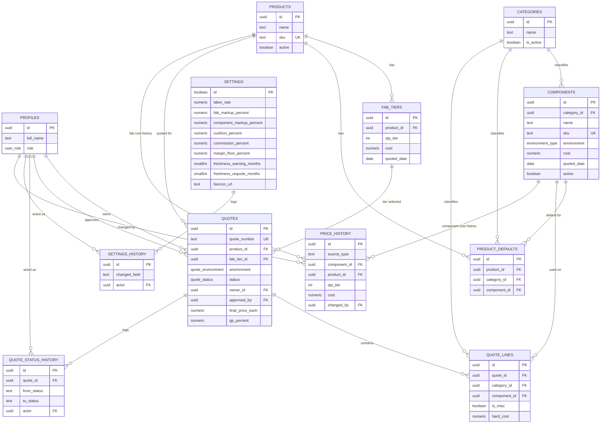

# DATABASE.md — Data Model

**Owner:** Viral Parikh
**Last updated:** 2026-08-13
**Source of truth for:** RedyQuote's entities, their columns and constraints, and the
design decisions behind why each table looks the way it does.

> Derived from: docs/PRD.md, docs/ARCHITECTURE.md, docs/PRODUCT.md, docs/TECH-STACK.md
> Downstream: `supabase/migrations/*.sql`, then `src/lib/supabase/types.ts` via
> `npm run db:types`

**This file describes the model, not the DDL.** The SQL that implements it — `CREATE TABLE`
statements, triggers, RPC functions, and RLS policies — lives in `supabase/migrations/*.sql`,
and **those files are the authoritative schema** (ARCHITECTURE.md §5). Where this file and a
migration disagree, the migration is right and this file is the defect.

The split exists so this file can be permanent. A prose copy of the DDL would be a second
copy of the same SQL, each free to drift from the other — the exact failure that rule was
written to prevent. There was such a copy, `docs/DATABASE-SQL.md`, and it produced two drift
bugs of its own before being retired once `0001`–`0009` covered it. The column tables below
stay because they describe the model a reader needs, and they are deliberately not a second
implementation of it: they carry types and constraints, never statements.

---

## Contents

1. [System Summary](#1-system-summary)
2. [Entity List](#2-entity-list)
3. [ERD](#3-erd)
4. [Table Definitions](#4-table-definitions)
5. [Design Decisions](#5-design-decisions)
6. [Open Items](#6-open-items)

---

## 1. System Summary

RedyQuote is a **single-tenant** quoting system for REDYREF's sales team. Two roles only —
**rep** and **admin** — sit on top of Supabase Auth. Admins own the product catalog,
component library, per-product fab tiers, global estimating settings, and branding.
Reps build quotes against that catalog; every quote moves through a fixed
`Draft → Review → Approved → Sent` lifecycle plus an explicit
`Review → Draft` request-changes path. Both steps out of `Review` are
admin-only, and all master-data writes are **enforced inside Postgres, not in application
code** (PRD-019, NFR-002) — master data by RLS policy, the two review transitions by the
`validate_quote_status_transition` trigger, because a `WITH CHECK` clause cannot see the old
row and so cannot express a transition at all.

**The approval gate is two triggers, not one.** `validate_quote_status_transition` is
`BEFORE UPDATE` and therefore covers only quotes that _move_. A companion
`BEFORE INSERT` trigger, `enforce_quote_created_in_draft`, is what stops a quote being
_created_ already approved — see §5.5. Neither is a backstop for the other, and RLS is a
backstop for neither.

Three structural guarantees drove this design, matching PRD's stated anti-patterns:

1. **Race-free quote numbering** (PRD-011) — a per-year counter table, incremented with a
   single atomic `INSERT ... ON CONFLICT DO UPDATE`, not client-side counting.
2. **Atomic multi-row writes** (PRD-014, PRD-015) — quote header + lines, and product +
   fab tiers + defaults + price history, are each written inside one `SECURITY INVOKER`
   Postgres function (RPC) so a partial failure can never leave a quote or product
   half-written.
3. **A single canonical cost breakdown** (NFR-007) — the schema stores the
   _server-recomputed_ pricing outputs on `quotes`/`quote_lines`; it does not encode a
   pricing formula. **The formula itself is an open PRD §7A placeholder** — see §5.1.

Everything else follows standard 3NF normalization, `uuid` primary keys, and audit trails
that are append-only at the database level (not just by application convention).

---

## 2. Entity List

| #   | Table                    | Role                                                                                                   |
| --- | ------------------------ | ------------------------------------------------------------------------------------------------------ |
| 1   | `profiles`               | Extends `auth.users` 1:1 — full name, role (`rep`/`admin`)                                             |
| 2   | `categories`             | Lookup for the fixed quote-line categories (PRD-007A)                                                  |
| 3   | `settings`               | Singleton row — labor rate, markups, cushion/commission %, margin floor, freshness thresholds, favicon |
| 4   | `settings_history`       | Append-only audit of `settings` field changes (PRD-018A)                                               |
| 5   | `products`               | Fabricated product catalog                                                                             |
| 6   | `fab_tiers`              | Fab cost per product per quantity break                                                                |
| 7   | `product_defaults`       | Default component per category per product                                                             |
| 8   | `components`             | Component library (category, environment, cost, labor hours)                                           |
| 9   | `price_history`          | Append-only cost history for components and fab tiers                                                  |
| 10  | `quote_number_sequences` | Internal counter backing race-free `Q-YYYY-NNNN` numbering                                             |
| 11  | `quotes`                 | Quote header + server-computed cost breakdown + lifecycle status                                       |
| 12  | `quote_lines`            | Quote line items (one per fixed category + unlimited misc)                                             |
| 13  | `quote_status_history`   | Append-only audit of quote status transitions (PRD-017)                                                |

**Two tables not named in ARCHITECTURE.md's data-design table** were added to close gaps
left open by the source docs — see §5.2 for the rationale on each (`categories`,
`quote_number_sequences`).

### Naming: fab tier vs. qty tier — two things, not one

Settled 2026-08-08. The docs had used _fab tier_, _fab-tier_, and _quantity tier_
interchangeably, which reads as either a synonym or a second entity and gave a reader no way
to tell. They are **two different things**, and the schema already distinguishes them:

- **Fab tier** — a row on `fab_tiers`: the fabrication cost for one product at one quantity
  break, with its own `cost`, `quoted_date`, and `vendor`. This is what a rep _selects_ on a
  quote, and what `quotes.fab_tier_id` points at. Prose term: **fab tier** (hyphenate only as
  a compound modifier — "fab-tier cost dates").
- **Qty tier** — the `qty_tier` integer on that row: the quantity break itself (25, 50, 100).
  A number, not a record. It is the shipped column header on the quotes list, right-aligned
  as a numeric.

Why it matters beyond tidiness: a quote binds a **fab tier row**, not a quantity. Binding the
integer instead would mean re-looking-up the cost at read time, which destroys the point of
`quotes.fab_cost_snapshot` (§4.11) — a later tier re-price would silently drift an
already-saved quote.

---

## 3. ERD



---

## 4. Table Definitions

Design conventions applied throughout:

- `uuid` primary keys via `gen_random_uuid()` (`pgcrypto`), except `settings` (boolean
  singleton PK) and `quote_number_sequences` (natural `year` PK — an internal counter, not
  a public entity).
- `created_at` / `updated_at` (`timestamptz`) on every mutable table; `updated_at`
  maintained by a shared trigger.
- **No `deleted_at` soft-delete column anywhere.** PRD-018 already defines the product's
  soft-delete equivalent as a domain-specific `active` boolean on `products`/`components`
  — an item stays fully visible and joinable (unlike a conventional hidden soft-delete
  row), just not selectable for _new_ quote lines. Every other table either forbids delete
  outright (append-only audit tables, `quotes`) or has no deletion requirement at all. See
  §5.3 for the full rationale.
- Every FK column is explicitly indexed (Postgres does not do this automatically).
- RLS is enabled on **every** table (`ALTER TABLE ... ENABLE ROW LEVEL SECURITY`), per
  ARCHITECTURE §1/§7.

### 4.1 `profiles`

1:1 extension of `auth.users` (PRD-001, PRD-002). Populated automatically by a trigger on
`auth.users` insert.

| Column       | Type          | Constraints                                 |
| ------------ | ------------- | ------------------------------------------- |
| `id`         | `uuid`        | PK, FK → `auth.users(id)` ON DELETE CASCADE |
| `full_name`  | `text`        | NOT NULL                                    |
| `role`       | `user_role`   | NOT NULL, DEFAULT `'rep'`                   |
| `created_at` | `timestamptz` | NOT NULL, DEFAULT `now()`                   |
| `updated_at` | `timestamptz` | NOT NULL, DEFAULT `now()`                   |

### 4.2 `categories`

Backs the **fixed quote-line categories** from PRD-007A. The actual list of names is a
product decision still pending in the source docs ("MUST be defined before implementation
begins") — modeling it as a table rather than a hardcoded enum lets that list be populated
and edited by migration/admin UI without a schema change once it's finalized.

| Column                      | Type          | Constraints                     |
| --------------------------- | ------------- | ------------------------------- |
| `id`                        | `uuid`        | PK, DEFAULT `gen_random_uuid()` |
| `name`                      | `text`        | NOT NULL, UNIQUE                |
| `is_active`                 | `boolean`     | NOT NULL, DEFAULT `true`        |
| `sort_order`                | `integer`     | NOT NULL, DEFAULT `0`           |
| `created_at` / `updated_at` | `timestamptz` | NOT NULL                        |

### 4.3 `settings`

Singleton row (PRD-012). Enforced as exactly one row via a `boolean` primary key with a
`CHECK (id)` constraint — a well-known Postgres singleton pattern (the PK's uniqueness
does the enforcement; the `CHECK` forbids the row ever being `false`).

| Column                      | Type            | Constraints                                  |
| --------------------------- | --------------- | -------------------------------------------- |
| `id`                        | `boolean`       | PK, DEFAULT `true`, CHECK (`id`)             |
| `labor_rate`                | `numeric(10,2)` | NOT NULL, CHECK `>= 0`                       |
| `fab_markup_percent`        | `numeric(5,2)`  | NOT NULL, CHECK `>= 0`                       |
| `component_markup_percent`  | `numeric(5,2)`  | NOT NULL, CHECK `>= 0`                       |
| `cushion_percent`           | `numeric(5,2)`  | NOT NULL, CHECK `>= 0`                       |
| `commission_percent`        | `numeric(5,2)`  | NOT NULL, CHECK `>= 0`                       |
| `margin_floor_percent`      | `numeric(5,2)`  | NOT NULL, CHECK `>= 0`                       |
| `freshness_warning_months`  | `smallint`      | NOT NULL, CHECK `>= 1`                       |
| `freshness_requote_months`  | `smallint`      | NOT NULL, CHECK `> freshness_warning_months` |
| `favicon_url`               | `text`          | NULL                                         |
| `updated_by`                | `uuid`          | FK → `profiles(id)`                          |
| `created_at` / `updated_at` | `timestamptz`   | NOT NULL                                     |

**Seeded values — placeholders, not REDYREF's rates.** `0003` seeds the singleton row with
`labor_rate 50.00`, `fab_markup_percent 50.00`, `component_markup_percent 20.00`,
`cushion_percent 2.50`, `commission_percent 1.25`, `margin_floor_percent 20.00`,
`freshness_warning_months 12`, `freshness_requote_months 24`. **None of these came from
REDYREF** (confirmed 2026-08-08) — the row exists because every column is `NOT NULL` with no
default, so a `settings` table without its row is a broken state to push. They are the shape
of a plausible estimate, nothing more.

Two consequences worth stating, because a placeholder that looks like data is worse than a
blank: no quote priced against these figures means anything, and the real values arrive with
PRD §7A sign-off — as a **settings edit by an admin**, not a migration, since the row is
already there. Do not treat a change to them as a schema change.

**Every rate on this row is a percent** — the two markups are stored as `50.00` / `20.00`,
not as the `1.50` / `1.20` multipliers that say the same thing. A multiplier in
`numeric(5,2)` can only step 0.01, which is one whole percentage point of markup; as a
percent the same type is 100× finer. `quote_lines.markup_percent` carries the same unit,
so the component markup pre-fills a new line with no conversion anywhere. The rationale is
recorded in full in `supabase/migrations/0004_settings_markup_units.sql`, which renamed
these two columns after `0003_settings.sql` had already shipped them as `*_multiplier`.

### 4.4 `settings_history`

Append-only (PRD-018A, NFR-005). One row per changed field, written by a trigger in the
same transaction as the `settings` update — never insertable directly by a client, because
the table has no client-facing INSERT/UPDATE/DELETE policy at all (`0003_settings.sql`).

**The only admin-only read in the schema** (PRD-018B). Every other table is flat-read for any
authenticated user; this one is not, because markup, commission, and margin-floor history is
compensation-adjacent. **Live on the remote** since 2026-08-08 — `0003` shipped the flat policy
and is immutable, so `0005_settings_history_admin_read.sql` dropped it and created the
`is_admin()` one in its place.

| Column          | Type          | Constraints                   |
| --------------- | ------------- | ----------------------------- |
| `id`            | `uuid`        | PK                            |
| `changed_field` | `text`        | NOT NULL                      |
| `old_value`     | `text`        | NULL                          |
| `new_value`     | `text`        | NULL                          |
| `actor`         | `uuid`        | NOT NULL, FK → `profiles(id)` |
| `changed_at`    | `timestamptz` | NOT NULL, DEFAULT `now()`     |

### 4.5 `products`

| Column                      | Type           | Constraints                         |
| --------------------------- | -------------- | ----------------------------------- |
| `id`                        | `uuid`         | PK                                  |
| `name`                      | `text`         | NOT NULL                            |
| `sku`                       | `text`         | NOT NULL, UNIQUE                    |
| `description`               | `text`         | NULL                                |
| `vendor`                    | `text`         | NULL                                |
| `est_labor_hours`           | `numeric(6,2)` | NOT NULL, DEFAULT `0`, CHECK `>= 0` |
| `active`                    | `boolean`      | NOT NULL, DEFAULT `true`            |
| `created_at` / `updated_at` | `timestamptz`  | NOT NULL                            |

### 4.6 `fab_tiers`

Fab tiers (PRD-004) — one per product per quantity break. One live row per `(product_id, qty_tier)`; changes to
`cost` append a `price_history` row via trigger.

| Column                      | Type            | Constraints                                     |
| --------------------------- | --------------- | ----------------------------------------------- |
| `id`                        | `uuid`          | PK                                              |
| `product_id`                | `uuid`          | NOT NULL, FK → `products(id)` ON DELETE CASCADE |
| `qty_tier`                  | `integer`       | NOT NULL, CHECK `> 0`                           |
| `cost`                      | `numeric(12,2)` | NOT NULL, CHECK `>= 0`                          |
| `quoted_date`               | `date`          | NOT NULL                                        |
| `vendor`                    | `text`          | NULL                                            |
| `created_at` / `updated_at` | `timestamptz`   | NOT NULL                                        |
| —                           | —               | UNIQUE `(product_id, qty_tier)`                 |

### 4.7 `product_defaults`

Default component per category per product (PRD-005).

| Column                      | Type          | Constraints                                     |
| --------------------------- | ------------- | ----------------------------------------------- |
| `id`                        | `uuid`        | PK                                              |
| `product_id`                | `uuid`        | NOT NULL, FK → `products(id)` ON DELETE CASCADE |
| `category_id`               | `uuid`        | NOT NULL, FK → `categories(id)`                 |
| `component_id`              | `uuid`        | FK → `components(id)`, NULL allowed             |
| `created_at` / `updated_at` | `timestamptz` | NOT NULL                                        |
| —                           | —             | UNIQUE `(product_id, category_id)`              |

### 4.8 `components`

Component library (PRD-006).

| Column                      | Type               | Constraints                         |
| --------------------------- | ------------------ | ----------------------------------- |
| `id`                        | `uuid`             | PK                                  |
| `category_id`               | `uuid`             | NOT NULL, FK → `categories(id)`     |
| `name`                      | `text`             | NOT NULL                            |
| `sku`                       | `text`             | NOT NULL, UNIQUE                    |
| `vendor`                    | `text`             | NULL                                |
| `environment`               | `environment_type` | NOT NULL, DEFAULT `'any'`           |
| `cost`                      | `numeric(12,2)`    | NOT NULL, CHECK `>= 0`              |
| `quoted_date`               | `date`             | NOT NULL — the vendor's quote date  |
| `default_labor_hours`       | `numeric(6,2)`     | NOT NULL, DEFAULT `0`, CHECK `>= 0` |
| `active`                    | `boolean`          | NOT NULL, DEFAULT `true`            |
| `created_at` / `updated_at` | `timestamptz`      | NOT NULL                            |

**`quoted_date` means the same thing here as on `fab_tiers`** — when the _vendor_ quoted
this cost, not when the row was last touched. It arrives in
`0009_components_quoted_date.sql`, not `0006`, because `0006` had already merged when the
omission was caught; editing it would have been skipped silently by `db push`, which is why
`0004` exists too.

The omission looked harmless and was not. With no date column a component's freshness could
only be derived from when a change was recorded, so PRD-009's badge would have measured "how
long since we edited this" on components and "how long since the vendor quoted" on fab
tiers, while feeding both to the same `freshness_warning_months` /
`freshness_requote_months` thresholds. The badge exists so a rep knows whether to trust a
price before quoting it; the recency of our own edits does not answer that question.

### 4.9 `price_history`

Append-only cost history for **either** a component **or** a fab tier (discriminated by
`source_type`), written automatically by triggers — on **insert**, seeding the cost a row is
born with, and on every subsequent change to `components.cost` or `fab_tiers.cost`
(NFR-005). Modeled as one table (matching ARCHITECTURE.md's data design table) with a
`CHECK` constraint enforcing exactly one relation is populated, rather than two separate
tables — see §5.4 for the trade-off.

**The insert half exists so the trail is whole.** With change-only triggers the cost a row
was born with never appears in history, and its first edit reads as though it were the
original — NFR-005 asks for the whole trail, not the edits to it.

**`quoted_date` carries one meaning on every row of this table: the vendor's quote date.**
That is worth stating because it was briefly untrue. `0006` gave `components` no date
column, so the component path wrote `current_date` — the moment the change was recorded —
while the fab-tier path wrote the vendor's date, and PRD-009 applied one set of thresholds
to both. `0009` adds `components.quoted_date` (§4.8) and rewrites both component logging
functions to read it. Any future writer of this table takes the source row's `quoted_date`;
nothing writes `current_date` here.

| Column         | Type            | Constraints                                                  |
| -------------- | --------------- | ------------------------------------------------------------ |
| `id`           | `uuid`          | PK                                                           |
| `source_type`  | `text`          | NOT NULL, CHECK IN (`'component'`,`'fab_tier'`)              |
| `component_id` | `uuid`          | FK → `components(id)`, NULL unless `source_type='component'` |
| `product_id`   | `uuid`          | FK → `products(id)`, NULL unless `source_type='fab_tier'`    |
| `qty_tier`     | `integer`       | NULL unless `source_type='fab_tier'`                         |
| `cost`         | `numeric(12,2)` | NOT NULL                                                     |
| `quoted_date`  | `date`          | NOT NULL                                                     |
| `vendor`       | `text`          | NULL                                                         |
| `changed_by`   | `uuid`          | NOT NULL, FK → `profiles(id)`                                |
| `created_at`   | `timestamptz`   | NOT NULL, DEFAULT `now()`                                    |

### 4.10 `quote_number_sequences`

Internal bookkeeping only — never read or written directly by application code, only by
`fn_next_quote_number()` (`0008_rpc_functions.sql`), which `fn_save_quote` calls. Backs PRD-011's
race-free `Q-YYYY-NNNN` numbering. RLS is on with **zero policies**, so no client can reach
the counter; that is why the allocator is the schema's one `SECURITY DEFINER` RPC.

| Column        | Type       | Constraints           |
| ------------- | ---------- | --------------------- |
| `year`        | `smallint` | PK                    |
| `last_number` | `integer`  | NOT NULL, DEFAULT `0` |

### 4.11 `quotes`

Quote header, server-computed cost breakdown, and lifecycle status (PRD-007, PRD-010,
PRD-011). `fab_cost_snapshot` and every `quote_lines.hard_cost` capture the cost **as of
the save**, so a later fab-tier or component price change never silently drifts a
previously saved quote — the historical basis is preserved, matching the "one consistent
formula, agreeing every time" requirement.

**`Review` is not a stored value.** The `quote_status` enum is
`('draft', 'pending_approval', 'approved', 'sent')` — four values, defined in
`supabase/migrations/0001_extensions_and_types.sql`. Every doc in this repo, this one
included, writes the lifecycle in product language as
`Draft → Review → Approved → Sent`, so **`Review` in prose means `pending_approval` in
the column.** There is no `'review'` value and a query filtering for one returns nothing.
The prose name is kept because it is what REDYREF calls the step; the mapping is stated
here rather than renaming the enum, because `0001` is applied and immutable.

| Column                      | Type                | Constraints                                              |
| --------------------------- | ------------------- | -------------------------------------------------------- |
| `id`                        | `uuid`              | PK                                                       |
| `quote_number`              | `text`              | NOT NULL, UNIQUE — format `Q-YYYY-NNNN`                  |
| `customer_name`             | `text`              | NOT NULL                                                 |
| `product_id`                | `uuid`              | NOT NULL, FK → `products(id)`                            |
| `fab_tier_id`               | `uuid`              | NOT NULL, FK → `fab_tiers(id)`                           |
| `fab_cost_snapshot`         | `numeric(12,2)`     | NOT NULL — fab cost captured at save time                |
| `environment`               | `quote_environment` | NOT NULL                                                 |
| `status`                    | `quote_status`      | NOT NULL, DEFAULT `'draft'`                              |
| `owner_id`                  | `uuid`              | NOT NULL, FK → `profiles(id)`                            |
| `approved_by`               | `uuid`              | FK → `profiles(id)`, NULL until approved                 |
| `submitted_at`              | `timestamptz`       | NULL                                                     |
| `approved_at`               | `timestamptz`       | NULL                                                     |
| `sent_at`                   | `timestamptz`       | NULL                                                     |
| `total_hard_cost`           | `numeric(12,2)`     | NOT NULL, DEFAULT `0`                                    |
| `total_labor_cost`          | `numeric(12,2)`     | NOT NULL, DEFAULT `0`                                    |
| `cushion_amount`            | `numeric(12,2)`     | NOT NULL, DEFAULT `0`                                    |
| `commission_amount`         | `numeric(12,2)`     | NOT NULL, DEFAULT `0`                                    |
| `total_cost`                | `numeric(12,2)`     | NOT NULL, DEFAULT `0`                                    |
| `final_price_each`          | `numeric(12,2)`     | NOT NULL, DEFAULT `0`                                    |
| `gp_dollars`                | `numeric(12,2)`     | NOT NULL, DEFAULT `0`                                    |
| `gp_percent`                | `numeric(6,3)`      | NOT NULL, DEFAULT `0`                                    |
| `below_margin_floor`        | `boolean`           | NOT NULL, DEFAULT `false` — advisory flag only (PRD-016) |
| `created_at` / `updated_at` | `timestamptz`       | NOT NULL                                                 |

> **The nine pricing columns above are storage for server-recomputed _outputs_, not an
> implementation of the formula.** The formula that produces them is PRD §7A's open
> placeholder — see §5.1.

### 4.12 `quote_lines`

One line per fixed category, plus unlimited ad-hoc misc lines (PRD-007, PRD-007A).

| Column                      | Type            | Constraints                                                                          |
| --------------------------- | --------------- | ------------------------------------------------------------------------------------ |
| `id`                        | `uuid`          | PK                                                                                   |
| `quote_id`                  | `uuid`          | NOT NULL, FK → `quotes(id)` ON DELETE CASCADE                                        |
| `category_id`               | `uuid`          | FK → `categories(id)`, required unless `is_misc`                                     |
| `component_id`              | `uuid`          | FK → `components(id)`, NULL for misc / custom lines                                  |
| `description`               | `text`          | NOT NULL                                                                             |
| `is_misc`                   | `boolean`       | NOT NULL, DEFAULT `false`                                                            |
| `hard_cost`                 | `numeric(12,2)` | NOT NULL, DEFAULT `0` — snapshotted at save                                          |
| `labor_hours`               | `numeric(6,2)`  | NOT NULL, DEFAULT `0`                                                                |
| `labor_cost`                | `numeric(12,2)` | NOT NULL, DEFAULT `0` — snapshotted at save                                          |
| `markup_percent`            | `numeric(5,2)`  | NOT NULL, DEFAULT `0`                                                                |
| `environment_mismatch`      | `boolean`       | NOT NULL, DEFAULT `false` (PRD-008)                                                  |
| `sort_order`                | `integer`       | NOT NULL, DEFAULT `0`                                                                |
| `created_at` / `updated_at` | `timestamptz`   | NOT NULL                                                                             |
| —                           | —               | CHECK (`is_misc` OR `category_id IS NOT NULL`)                                       |
| —                           | —               | UNIQUE partial index `(quote_id, category_id) WHERE NOT is_misc` — enforces PRD-007A |

### 4.13 `quote_status_history`

Append-only (PRD-017, NFR-005). Written by an `AFTER UPDATE` trigger on `quotes`, in the
same transaction as the status change — never insertable directly by a client, because the
table has no client-facing INSERT/UPDATE/DELETE policy at all (`0007_quotes.sql`).

| Column        | Type          | Constraints                                   |
| ------------- | ------------- | --------------------------------------------- |
| `id`          | `uuid`        | PK                                            |
| `quote_id`    | `uuid`        | NOT NULL, FK → `quotes(id)` ON DELETE CASCADE |
| `from_status` | `text`        | NULL (NULL on the initial Draft insert)       |
| `to_status`   | `text`        | NOT NULL                                      |
| `actor`       | `uuid`        | NOT NULL, FK → `profiles(id)`                 |
| `changed_at`  | `timestamptz` | NOT NULL, DEFAULT `now()`                     |

---

## 5. Design Decisions

Why the model looks like this. Each of these was a fork in the road; recording the reasoning
is what stops it being re-litigated from scratch, or quietly reversed.

### 5.1 Pricing columns are storage, not a formula

PRD §7A states the pricing formula and rounding rules are "pending product/pricing sign-off"
and that "no implementation may invent or infer calculation order, rounding points, or
persisted pricing fields" ahead of that.

This model takes the narrowest reading consistent with being useful today: it defines
_storage_ for the nine output values ARCHITECTURE.md's data-design table already names
(`total_hard_cost`, `gp_percent`, `final_price_each`, and the rest) as plain `numeric`
columns with **no formula, trigger, or generated-column logic behind them**. The server
recomputes those values and writes them (NFR-007); the database only holds them.

Consequence, carried in [§6](#6-open-items): the save RPC must not be wired into a real
Server Action until PRD §7A is signed off.

**The pricing trust boundary is a Server Action convention, not a database guarantee — and
this is the honest statement of a known gap, not a guarantee restated.** ARCHITECTURE's
"server recomputes the canonical breakdown" invariant describes what the _write path_ does.
It does not describe what the _database_ permits, and the two are not the same thing here.
`quotes_update_owner_or_admin` grants table-wide UPDATE, so the row's owner can write any of
the ten value columns directly over the Data API — the nine pricing outputs plus
`fab_cost_snapshot` — with no Server Action involved. Nothing in the schema rejects it.

Sized honestly: a rep cannot approve their own quote (§5.5 and the transition trigger cover
that), so a tampered number is seen by an admin at review. The sharp edge is
`below_margin_floor`, the advisory flag PRD-016 puts in front of that approver — set it
`false` on a quote genuinely below floor and the review that is supposed to catch the price
no longer flags it.

**Deliberately not closed yet.** Every enforcement option needs a final column list, and PRD
§7A is what decides which pricing fields are canonical versus preview-only. A guard authored
against today's guess would be frozen into an immutable migration against a list that may
change — the same mistake `0004_settings_markup_units.sql` exists to commemorate. The
options considered and their costs are recorded with the open item in [§6](#6-open-items);
authoring the guard is on that sign-off's checklist. Do not treat this paragraph as
permission to write a client-trusted number through a Server Action — the recompute rule
still stands. It is a statement that the database is not currently backing it up.

### 5.2 Two tables exist beyond ARCHITECTURE.md's data-design table

- **`categories`** — PRD-007A's fixed-category list is explicitly "MUST be defined before
  implementation begins" and appears in no source doc. Modeling it as a lookup table rather
  than a hardcoded Postgres enum means the list can be entered as data once decided, with no
  schema migration, and gives `components.category_id` and `quote_lines.category_id` real
  referential integrity instead of a free-text column. Nothing here invents the categories
  themselves — see [§6](#6-open-items).
- **`quote_number_sequences`** — a pure implementation detail behind PRD-011, never exposed
  to a client. It is what lets the save RPC allocate a number with a single
  `INSERT ... ON CONFLICT DO UPDATE ... RETURNING` instead of an explicit
  `SELECT ... FOR UPDATE` lock, which is what makes PRD-011's race-freedom structural rather
  than careful.

### 5.3 No `deleted_at` anywhere

Every table was checked against the question rather than the column being added by reflex.

`products` and `components` already carry a domain-specific soft state — `active` (PRD-018)
— that behaves **unlike** a conventional soft-delete: deactivated rows stay fully visible
and joinable everywhere, including on quotes that already reference them, rather than being
filtered out by default. Layering a generic `deleted_at` on top would be redundant with
`active` and would invite two different "is this gone?" checks to drift apart.

Every other table either forbids deletion outright via RLS (`quotes`, the audit tables) or
has no deletion requirement in the source docs at all.

### 5.4 `price_history` is one polymorphic table, not two

ARCHITECTURE.md's data-design table names a single `price_history` covering both component
costs and fab-tier costs, so this model follows it rather than splitting into
`component_price_history` / `fab_tier_price_history`.

The trade-off is real and worth stating: the single-table version needs the `source_type`
discriminator plus a `CHECK` constraint to stop the two row shapes mixing, where two tables
would get that for free from their own `NOT NULL` constraints — at the cost of duplicated
DDL and query logic.

If price-history reporting ever grows query needs specific to one source type, splitting is
a clean, low-risk migration later: nothing references `price_history` by name outside the
two logging triggers.

### 5.5 A quote is created in Draft, enforced at INSERT

Decided 2026-08-13. `validate_quote_status_transition` is a `BEFORE UPDATE` trigger, so it
never sees an `INSERT`. `quotes_insert_own` checks `owner_id = auth.uid()` and nothing else.
Together that left the approval gate defeatable by the one statement the trigger does not
cover: a rep with a valid session could `POST` a new row carrying `status = 'approved'`,
`approved_by = <self>`, and `approved_at = now()`, and the database would accept it. No
Server Action, no UI, no admin. The gate is this repo's top invariant and it held only on
the update path.

**A companion `BEFORE INSERT` trigger on `quotes` closes it**, rejecting any insert where
`status <> 'draft'` or any of `submitted_at` / `approved_by` / `approved_at` / `sent_at` is
non-null. The five columns describe where a quote _has been_, and a brand-new quote has been
nowhere. `fn_save_quote` sets none of them on insert, so no legitimate caller can trip the
guard — any trip is a bug or a bypassed client.

**It raises rather than silently coercing**, matching `enforce_profile_role_change` and
`validate_quote_status_transition`. Coercing to Draft would never break a caller, but it
hands a bypassed client a success response and leaves the attempt no trace; a guard that
cannot be observed failing is indistinguishable from one that was never added.

**It carries no `auth.uid() is not null` carve-out, unlike `enforce_profile_role_change` in
`0002`** — and the difference is the point, not an inconsistency. It was drafted with one,
on the reasoning that `0002` set a precedent and the exemption cost nothing. Both halves of
that were wrong, and the trigger was rewritten unconditional on 2026-08-13.

`0002` needs its carve-out to solve a **bootstrap** problem: `handle_new_user()` always
writes `'rep'`, so without an exemption for the NULL-`auth.uid()` dashboard session the
schema could never have a first admin at all. Importing historical quotes has no
chicken-and-egg of that kind — it is ordinary data loading.

And the carve-out did not work. `log_quote_status_insert` writes `auth.uid()` into
`quote_status_history.actor`, which is `NOT NULL`, so a `postgres`-context insert fails at
the audit row whether or not this trigger exempts it. Making it work would have meant
dropping that `NOT NULL` permanently — trading the standing guarantee that every audit row
names a real person for a convenience on a one-time event that appears nowhere in the PRD.

If REDYREF ever does import historical quotes, that migration disables both triggers around
the load and re-enables them after. It is more typing than a carve-out and it shows up in
review, which is the right trade for a schema whose audit trail is a requirement (PRD-017,
NFR-005).

**This closes the lifecycle columns only.** The ten value columns stay openly writable by
the row owner — that is the separate, still-open gap in §5.1.

### 5.6 `environment_mismatch` is client-supplied, and that is a narrower guarantee

`quote_lines.environment_mismatch` (PRD-008) is written from a value passed into
`fn_save_quote`, computed by the same shared TypeScript module the rest of NFR-007 relies
on. It is **not** recomputed server-side the way the pricing totals are, and the difference
is deliberate rather than an oversight: NFR-007 names the cost breakdown specifically, and
no requirement asks for the mismatch flag to be re-derived in Postgres.

State the consequence plainly, because "computed by the shared module" reads like a
guarantee and is not one: a bypassed client can save a line with
`environment_mismatch = false` on a component whose `environment` genuinely conflicts with
the quote's, and nothing rejects it. The flag is an advisory badge, not a constraint.

If that guarantee is wanted later it is a `BEFORE INSERT OR UPDATE` trigger on
`quote_lines` comparing `components.environment` against the parent quote's `environment`
and overwriting whatever the client sent — the same treatment the pricing totals will get
when §6.1 is closed. Cheap, and it needs no PRD decision, unlike the pricing guard.

---

## 6. Open Items

Unresolved questions this model deliberately does not answer. Each is a product decision,
not missing work — resolving one is a change to the doc that owns it, not a change here
alone.

| Item                                 | Blocks                                                     | Owner decision needed                                                                                                                                                                                                                                                                                                                                                                                                    |
| ------------------------------------ | ---------------------------------------------------------- | ------------------------------------------------------------------------------------------------------------------------------------------------------------------------------------------------------------------------------------------------------------------------------------------------------------------------------------------------------------------------------------------------------------------------ |
| **Pricing formula** (PRD §7A)        | Wiring the save RPC into a real Server Action              | **Decider: Viral Parikh (Product Owner), with REDYREF sales and estimating.** Calculation order, rounding points, and which fields are canonical vs. preview-only. On sign-off, confirm the nine columns on `quotes` still match that field list and reconcile if not — **and author the pricing-column write guard described below, which is deliberately deferred to this decision (§5.1).**                           |
| **Fixed-category list** (PRD-007A)   | Populating `categories`; the quote builder's row structure | **Decider: Viral Parikh (Product Owner), with REDYREF estimating.** REDYREF's actual category names, ordered. The table ships empty — nothing in this repo invents them.                                                                                                                                                                                                                                                 |
| **Editing a quote after submission** | Whether `quote_lines` freezes outside `Draft`              | Neither PRD.md nor ARCHITECTURE.md says whether a rep may still edit line items once a quote leaves `Draft` — only that _status transitions_ follow the fixed state machine. This model allows content edits at any status by owner-or-admin. If the real process expects a submitted quote's lines to be frozen, that is a trigger, and it should be a deliberate decision rather than an assumption baked in silently. |

### 6.1 The pricing-column write guard, deferred to PRD §7A

Deferred 2026-08-13, not overlooked. §5.1 states the gap: the ten value columns on `quotes`
are writable directly by the row owner. Closing it is on the §7A sign-off checklist above.
Three options were weighed; recording them here is what stops the cheapest-looking one being
picked later without the cost being seen again.

| Option                                                                                                                | Cost                                                                                                                                                                                                                                                                                                                                                              |
| --------------------------------------------------------------------------------------------------------------------- | ----------------------------------------------------------------------------------------------------------------------------------------------------------------------------------------------------------------------------------------------------------------------------------------------------------------------------------------------------------------- |
| **Session-flag guard trigger** — reject writes to the ten columns unless `fn_save_quote` set a transaction-local flag | Formula-independent and compatible with `SECURITY INVOKER`. But it is a pattern this repo has not used anywhere, and every write path must remember to set the flag — a guard whose bypass is "forgot one line".                                                                                                                                                  |
| **Column-level `REVOKE` + `SECURITY DEFINER`**                                                                        | Strongest guarantee, but `fn_save_quote` is `SECURITY INVOKER` and runs as the caller, so a `REVOKE ... FROM authenticated` breaks the RPC along with the direct write. It only works if the function becomes `SECURITY DEFINER`, which moves the owner-or-admin check out of RLS and into function code — a trade the SQL spec records as deliberately rejected. |
| **Guard `below_margin_floor` only**                                                                                   | Protects the one signal the approver relies on, and its meaning does not depend on §7A's rounding or field-list decisions the way the numbers do. Leaves the nine numeric columns open, so it is a narrowing, not a fix.                                                                                                                                          |

Why none of them yet: each needs a final column list, and §7A is what fixes which fields are
canonical versus preview-only. A guard frozen into an immutable migration against today's
guess repeats `0004`.

### 6.2 Do not "harden" the approval gate with an RLS policy — it decides an open item

This one is a trap, and it looks like a free security win, which is what makes it worth
writing down rather than leaving to be rediscovered.

The `Review → Approved` transition is admin-only by trigger alone.
`quotes_update_owner_or_admin` says nothing about status, and there is deliberately no
second RLS layer. Sooner or later someone will read that as a gap and reach for a
`WITH CHECK`. A `WITH CHECK` clause sees only the **new** row, never the old, so it cannot
express a transition at all — the closest it gets is:

```sql
with check ((status <> 'approved' or is_admin()) and (owner_id = auth.uid() or is_admin()))
```

which reads as "no non-admin may leave a quote sitting in Approved."

**That policy also blocks a rep from editing any field of their own already-approved quote.**
Which silently answers the third open item in the table above — "Editing a quote after
submission" — in the freeze direction, without anyone deciding it. A product decision made
as a side effect of a hardening tweak is the worst way to make one, and it would be
invisible in review: the diff looks like security, not scope.

**Add this policy when the freeze question is decided, and not before.** If the answer comes
back "reps may keep editing after submission," this policy is simply wrong and the trigger
stays the only layer — which is fine, because it is a complete layer on its own (NFR-002).
